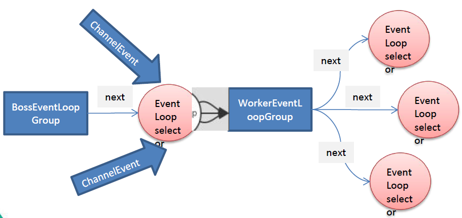

### Netty 主要组件总结

#### EventLoopGroup&NioEventLoopGroup

NioEventLoopGroup 是 EventLoopGroup 的实现类，而开发过程中主要使用的也是NioEventLoopGroup，来创建线程组。

* EventLoopGroup 是一组 EventLoop 的抽象，Netty 为了更好的利用多核 CPU 资源，一般会有多个 EventLoop 同时工作，每个 EventLoop 维护着一个 Selector 实例。

* EventLoopGroup 提供 next 接口，可以从组里面按照一定规则获取其中一个 EventLoop 来处理任务。在 Netty 服务器端编程中，我们一般都需要提供两个 EventLoopGroup，例如：BossEventLoopGroup 和 WorkerEventLoopGroup。

* 通常一个服务端口即一个 ServerSocketChannel 对应一个 Selector 和一个 EventLoop 线程。BossEventLoop 负责接收客户端的连接并将 SocketChannel 交给 WorkerEventLoopGroup 来进行 IO 处理，如下图所示：

  

  * BossEventLoopGroup 通常是一个单线程的 EventLoop，EventLoop 维护着一个注册了 ServerSocketChannel 的 Selector 实例 BossEventLoop 不断轮询 Selector 将连接事件分离出来。
  
  * BossEventLoopGroup 通常只关注 OP_ACCEPT 事件，然后将接收到的 SocketChannel 交给 WorkerEventLoopGroup。
  
  * WorkerEventLoopGroup 会由 next 选择其中一个 EventLoop 来将这个 SocketChannel 注册到其维护的 Selector 并对其后续的 IO 事件进行处理。
  
* 常用方法如下：

  * public NioEventLoopGroup()，构造方法。
  
  * public Future<?> shutdownGracefully()，断开连接，关闭线程。

#### Selector

Selector 组件在 Netty 框架中对开发者已经做到了透明化处理，在使用 Netty 进行网络编程时，Selector 在框架底层运作，开发者无感知。

**特点如下**：

* Netty 基于 Selector 对象实现 I/O 多路复用，通过 Selector 一个线程可以监听多个连接的 Channel 事件。

* 当向一个 Selector 中注册 Channel 后，Selector 内部的机制就可以自动不断地查询 (Select) 这些注册的 Channel 是否有已就绪的 I/O 事件（例如可读，可写，网络连接完成等），这样程序就可以很简单地使用一个线程高效地管理多个 Channel。

#### Bootstrap&ServerBootStrap

Bootstrap 意思是引导，一个 Netty 应用通常由一个 Bootstrap 开始，主要作用是配置整个 Netty 程序，串联各个组件，Netty 中 Bootstrap 类是客户端程序的启动引导类，ServerBootstrap 是服务端启动引导类。

**常见的方法**：

* public ServerBootstrap group(EventLoopGroup parentGroup, EventLoopGroup childGroup)，该方法用于服务端，用来设置两个 EventLoopGroup。

* public B group(EventLoopGroup group) ，该方法用于客户端，用来设置一个 EventLoopGroup。

* public B channel(Class<? extends C> channelClass)，该方法用于服务端，用来设置服务器端的通道实现。

* public <T> B option(ChannelOption<T> option, T value)，该方法用于服务端，给服务端 ServerChannel 添加配置。

* public <T> ServerBootstrap childOption(ChannelOption<T> childOption, T value)，该方法用于服务端，用来给接收到的通道添加配置。

* public B handler(ChannelHandler handler)，该方法用于服务端，针对 BossGroup 线程组设置业务处理类（自定义的handler）。

* public ServerBootstrap childHandler(ChannelHandler childHandler)，该方法用于服务端，针对 WorkerGroup 线程组设置业务处理类（自定义的 handler）。

* public ChannelFuture bind(int inetPort) ，该方法用于服务端，用来设置占用的端口号。

* public ChannelFuture connect(String inetHost, int inetPort) ，该方法用于客户端，用来连接服务端。

#### Channel

Channel 组件对应的就是在 Bootstrap 或者 ServerBootstrap 中使用 channel() 方法指定的通道类型。

**特点如下**：

* Netty 网络通信的组件，能够用于执行网络 I/O 操作。

* 通过 Channel 可获得当前网络连接的通道的状态。

* 通过 Channel 可获得网络连接的配置参数 （例如接收缓冲区大小）。

* Channel 提供异步的网络 I/O 操作(如建立连接，读写，绑定端口)，异步调用意味着任何 I/O 调用都将立即返回，并且不保证在调用结束时所请求的 I/O 操作已完成。

* 调用立即返回一个 ChannelFuture 实例，通过注册监听器到 ChannelFuture 上，可以 I/O 操作成功、失败或取消时回调通知调用方。

* 支持关联 I/O 操作与对应的处理程序。

* 不同协议、不同的阻塞类型的连接都有不同的 Channel 类型与之对应，常用的 Channel 类型:

  * NioSocketChannel，异步的客户端 TCP Socket 连接。
  
  * NioServerSocketChannel，异步的服务器端 TCP Socket 连接。
  
  * NioDatagramChannel，异步的 UDP 连接。
  
  * NioSctpChannel，异步的客户端 Sctp 连接。
  
  * NioSctpServerChannel，异步的 Sctp 服务器端连接，这些通道涵盖了 UDP 和 TCP 网络 I/O 以及文件 IO。

#### ChannelOption 通道配置选项

ChannelOption 组件就是 Bootstrap 或者 ServerBootstrap 调用 channel() 方法后再调用 option() 或者 childOption() 时存放的参数。

* Netty 在创建 Channel 实例后,一般都需要设置 ChannelOption 参数。

* 常见的 ChannelOption 参数如下:

  * ChannelOption.SO_BACKLOG（常用于option）：对应 TCP/IP 协议 listen 函数中的 backlog 参数，用来初始化服务器可连接队列大小。服务端处理客户端连接请求是顺序处理的，所以同一时间只能处理一个客户端连接。多个客户端来的时候，服务端将不能处理的客户端连接请求放在队列中等待处理，backlog 参数指定了队列的大小。
  
  * ChannelOption.SO_KEEPALIVE（常用于childOption）：一直保持连接活动状态。

#### ChannelHandler及其实现类

ChannelHandler 组件对应的就是在 Bootstrap 或者 ServerBootstrap 中使用 handler() 或者 childHandler() 方法在pipeline中添加的处理器类型，这个处理通常需要开发者自己实现。

**特点如下**：

* ChannelHandler 是一个接口，处理 I/O 事件或拦截 I/O 操作，并将其转发到其 ChannelPipeline(业务处理链) 中的下一个处理程序。

* ChannelHandler 本身并没有提供很多方法，因为这个接口有许多的方法需要实现，方便使用期间，可以继承它的子类

* ChannelHandler 及其继承接口和实现类如下：

  * (Interface) ChannelInboundHandler 用于处理入站 I/O 事件。
  
  * (Interface) ChannelOutBoundHandler 用于处理出站 I/O 事件。
  
  * (Class) ChannelInboundHandlerAdapter 用于处理入站 I/O 事件。  【**常用**】
  
  * (Class) ChannelOutboundHandlerAdapter 用于处理出站 I/O 事件。  【**常用**】
  
  * (Class) ChannelDuplexHandler 用于处理入站和出站事件。
  
* 开发者经常需要自定义一个 Handler 类去继承 ChannelInboundHandlerAdapter，然后通过重写相应方法实现业务逻辑，常用方法如下：

  * public void handlerAdded(ChannelHandlerContext ctx)，处理 Channel 连接就绪事件。

  * public void handlerRemoved(ChannelHandlerContext ctx)，处理 Channel 断开连接就绪事件。
  
  * public void channelRegistered(ChannelHandlerContext ctx)，处理 Channel 注册就绪事件。
  
  * public void channelUnregistered(ChannelHandlerContext ctx)，处理 Channel 注销就绪事件。
  
  * public void channelActive(ChannelHandlerContext ctx)，处理 Channel 准备（活动）就绪事件。
  
  * public void channelInactive(ChannelHandlerContext ctx)，处理 Channel 非活动就绪事件。
  
  * public void channelRead(ChannelHandlerContext ctx, Object msg)，处理 Channel 可读就绪事件。
  
  * public void channelReadComplete(ChannelHandlerContext ctx)，处理 Channel 读完毕就绪事件。
  
  * public void exceptionCaught(ChannelHandlerContext ctx, Throwable cause)，处理 Channel 异常就绪事件。
  
  * public void userEventTriggered(ChannelHandlerContext ctx, Object evt)，处理用户自定义的事件，比如 Netty 中的心跳触发事件（后续模块会有介绍）。

* 但是有一种更加深入人心的做法来实现自定义处理器，即继承 SimpleChannelInboundHandler<T>，然后重写对应方法实现业务逻辑，常用方法如下：

  * protected abstract void channelRead0(ChannelHandlerContext ctx, I msg)，必须实现的一个处理可读就绪事件的方法，对于读取事件而言可以简化数据类型的转换。
  
  * public void handlerAdded(ChannelHandlerContext ctx)，处理 Channel 连接就绪事件。
  
  * public void handlerRemoved(ChannelHandlerContext ctx)，处理 Channel 断开连接就绪事件。

  * public void channelRegistered(ChannelHandlerContext ctx)，处理 Channel 注册就绪事件。

  * public void channelUnregistered(ChannelHandlerContext ctx)，处理 Channel 注销就绪事件。

  * public void channelActive(ChannelHandlerContext ctx)，处理 Channel 准备（活动）就绪事件。

  * public void channelInactive(ChannelHandlerContext ctx)，处理 Channel 非活动就绪事件。

  * public void channelRead(ChannelHandlerContext ctx, Object msg)，处理 Channel 可读就绪事件。

  * public void channelReadComplete(ChannelHandlerContext ctx)，处理 Channel 读完毕就绪事件。

  * public void exceptionCaught(ChannelHandlerContext ctx, Throwable cause)，处理 Channel 异常就绪事件。

  * public void userEventTriggered(ChannelHandlerContext ctx, Object evt)，处理用户自定义的事件，比如 Netty 中的心跳触发事件（后续模块会有介绍）。

* 其实在 Netty 中还有许多已经封装好的处理器，这些处理器的位置通常处于 pipeline 中自定义处理器之前：

  * LoggingHandler(LogLevel logLevel) 日志处理器，常用于服务端 handler 方法中。

  * HttpServerCodec() Http编解码处理器，常用于服务端 childHandler 方法中，需要和Web客户端进行通信的时候会用到。
  
  * StringEncoder() 字符串编码处理器，常用于服务端 childHandler 方法中，无特殊情况，该处理器都需要添加在 pipeline 靠前位置。

  * StringDecoder() 字符串解码处理器，常用于服务端 childHandler 方法中，无特殊情况，该处理器都需要添加在 pipeline 靠前位置。

  * IdleStateHandler() 心跳（空闲状态）检测处理器，常用于服务端 childHandler 方法中，紧接着会添加一个自定义处理空闲状态的处理器。

  * ChunkedWriteHandler() 块传输处理器，常用于服务端 childHandler 方法中，一般和 WebSocket 编程搭配使用。

  * HttpObjectAggregator() Http对象聚合处理器，常用于服务端 childHandler 方法中，一般和 WebSocket 编程搭配使用，常跟在 ChunkedWriteHandler() 处理器之后。

  * WebSocketServerProtocolHandler() WebSocket 协议处理器，常用于服务端 childHandler 方法中，将 Http 协议升级为 WS 协议，保持长连接。

#### Pipeline&ChannelPipeline

在 Netty 中，ChannelPipeline 是一个非常重要的点：

* ChannelPipeline 是一个 Handler 的集合，它负责处理和拦截 inbound 或者 outbound 的事件和操作，相当于一个贯穿 Netty 的链。(也可以这样理解： ChannelPipeline 是 保存 ChannelHandler 的 List，用于处理或拦截 Channel 的入站事件和出站操作)。

* ChannelPipeline 实现了一种高级形式的拦截过滤器模式，使用户可以完全控制事件的处理方式，以及 Channel 中各个的 ChannelHandler 如何相互交互。

* 在 Netty 中每个 Channel 都有且仅有一个 ChannelPipeline 与之对应，它们的组成关系如下图：

  

  * 一个 Channel 包含了一个 ChannelPipeline，而 ChannelPipeline 中又维护了一个由  ChannelHandlerContext 组成的双向链表，并且每个 ChannelHandlerContext 中又关联着一个 ChannelHandler。
  
  * 入站事件和出站事件在一个双向链表中，入站事件会从链表 head 往后传递到最后一个入站的 handler ，出站事件会从链表 tail 往前传递到最前一个出站的 handler，两种类型的 handler 互不干扰。
  
* 常用方法如下：

  * ChannelPipeline addFirst(ChannelHandler... handlers)，把一个业务处理类（handler）添加到链中的第一个位置。
  
  * ChannelPipeline addLast(ChannelHandler... handlers)，把一个业务处理类（handler）添加到链中的最后一个位置。

#### ChannelHandlerContext 上下文

ChannelHandlerContext 组件主要存在于ChannelHandler及其实现类里的方法参数中，这个组件中包含了客户端和服务端连接中的绝大部分信息。

* 保存 Channel 相关的所有上下文信息，同时关联一个 ChannelHandler 对象。

* 即 ChannelHandlerContext 中包含一个具体的事件处理器 ChannelHandler ，同时ChannelHandlerContext 中也绑定了对应的 pipeline 和 Channel 的信息，方便对 ChannelHandler进行调用。

* 常用方法如下：

  * ChannelFuture close()，关闭通道。
  
  * ChannelOutboundInvoker flush()，刷新。
  
  * ChannelFuture writeAndFlush(Object msg) ，将数据写到 ChannelPipeline 中当前 ChannelHandler 的下一个 ChannelHandler 开始处理（出站），说白了就是让数据继续往下流动。

#### Future&ChanelFuture

Netty 中所有的 IO 操作都是异步的，不能立刻得知消息是否被正确处理。但是可以过一会等它执行完成或者直接注册一个监听，具体的实现就是通过 Future 和 ChannelFutures，他们可以注册一个监听，当操作执行成功或失败时监听会自动触发注册的监听事件。

**常见的方法**：

* Channel channel()，返回当前正在进行 IO 操作的通道。

* ChannelFuture sync()，等待异步操作执行完毕。

* isDone()，判断当前操作是否完成。

* isSuccess()，判断已完成的当前操作是否成功。

* cause()，获取已完成的当前操作失败的原因。

* isCancelled()，判断已完成的当前操作是否被取消。

* addListener()，注册监听器，当操作已完成(isDone 方法返回完成)，将会通知指定的监听器；如果 Future 对象已完成，则通知指定的监听器。

**接下来，将根据上面的描述对 Netty 处理事件进行较为标准的示例代码编写**