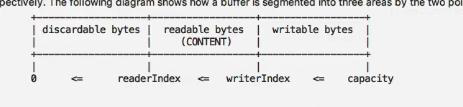

### Netty 缓冲区工具类

Unpooled 是 Netty 提供的一个专门用来操作缓冲区(即 Netty 的数据容器)的工具类，再 Netty 中缓冲区是 ByteBuf 类。

* 常用方法如下：

  * public static ByteBuf copiedBuffer(CharSequence string, Charset charset)，通过给定的数据和字符编码返回一个 ByteBuf 对象（类似于 NIO 中的 ByteBuffer 但有区别）。

* 接下来用示例代码说明 Unpooled 获取 Netty 数据容器 ByteBuf 的基本使用方法，下面是 ByteBuf 的一个结构示意简图：

  