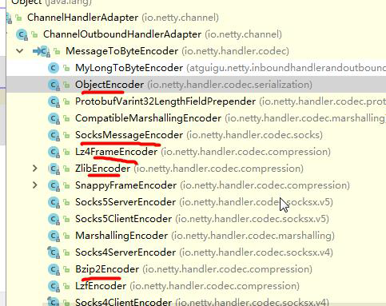

### Netty 编解码器和 Handler 的调用机制

**基本说明**：

1. Netty 的组件设计：Netty 的主要组件有 Channel、EventLoop、ChannelFuture、ChannelHandler、ChannelPipe 等。

2. ChannelHandler 充当了处理入站和出站数据的应用程序逻辑的容器。例如，实现 ChannelInboundHandler 接口或继承 ChannelInboundHandlerAdapter/SimpleChannelInboundHandler<T>，你就可以接收入站事件和数据，这些数据会被业务逻辑处理。当要给客户端发送响应时，也可以从 ChannelInboundHandler 冲刷数据。业务逻辑通常写在一个或者多个 ChannelInboundHandler 中。 ChannelOutboundHandler 原理一样，只不过它是用来处理出站数据的。

3. ChannelPipeline 提供了 ChannelHandler 链的容器。以客户端应用程序为例，如果事件的运动方向是从客户端到服务端的，那么我们称这些事件为出站的，即客户端发送给服务端的数据会通过 pipeline 中的一系列 ChannelOutboundHandler，并被这些Handler处理，反之则称为入站的。

4. 入站和出站示意图如下：
   
   

**编解码器**：

1. 当 Netty 发送或者接受一个消息的时候，就将会发生一次数据转换。入站消息会被解码：从字节转换为另一种格式（比如 java 对象）；如果是出站消息，它会被编码成字节。

2. Netty 提供一系列实用的编解码器，他们都实现了 ChannelInboundHandler 或者 ChannelOutboundHandler 接口。在这些类中，channelRead 方法已经被重写了。以入站为例，对于每个从入站 Channel 读取的消息，这个方法会被调用。随后，它将调用由解码器所提供的 decode() 方法进行解码，并将已经解码的字节转发给 ChannelPipeline 中的下一个 ChannelInboundHandler。

**解码器-ByteToMessageDecoder & 编码器-MessageToByteEncoder**

1. 关系继承图如下：

   

2. 该解码器常用来处理粘包问题，由于不可能知道远程节点是否会一次性发送一个完整的信息，TCP 有可能出现粘包拆包的问题，这个类会对入站数据进行缓冲，直到它准备好被处理。

3. ByteToMessageDecoder实例分析：

   ```java
   import io.netty.channel.ChannelHandlerContext;    
   public class ToIntegerDecoder extends ByteToMessageDecoder{
       @Override
       protected void decode(ChannelHandlerContext ctx,ByteBuf in,List<Object> out) throws Exception{
           if (in.readableBytes() >= 4){
               out.add(in.readInt());
           }
       }
   }
   ```
   
   说明：这个例子，每次入站从 ByteBuf 中读取 4 字节，将其解码为一个 int，然后将它添加到下一个 List 中。当没有更多元素可以被添加到该 List 中时，它的内容将会被发送给下一个 ChannelInboundHandler。 int 在被添加到 List 中时，会被自动装箱为 Integer。在调用 readInt() 方法前必须验证所输入的 ByteBuf 是否具有足够的数据。

**Netty 的 Handler 调用机制**：

接下来会使用一个实例（**详情见本模块 `byte_to_message` 包下的代码**），结合编解码器来说明 Handler 的调用机制：

1. 使用自定义的编码器和解码器来说明 Netty 的 Handler 调用机制：客户端发送 long 型数据 -> 服务器；服务端发送 long 型数据 -> 客户端。

2. 流程图如下：
   
   

3. 结论：

   * 不论解码器 Handler 还是编码器 Handler ，即接收的消息类型必须与待处理的消息类型一致，否则该 Handler 不会被执行。
   
   * 在解码器进行数据解码时，需要判断缓存区( ByteBuf )的数据是否足够，否则接收到的结果可能会和期望结果不一致。

**解码器-ReplayingDecoder**

即 public abstract class ReplayingDecoder<S> extends ByteToMessageDecoder。

ReplayingDecoder 扩展了 ByteToMessageDecoder 类，使用这个类，我们不必调用 readableBytes() 方法。参数S指定了用户状态管理的类型，其中 Void 代表不需要状态管理。

接下来对 `byte_to_message` 包下的代码用此解码器进行改写，代码处理 `replaying` 包下。

ReplayingDecoder 使用方便，但它也有一些局限性：

* 并不是所有的 ByteBuf 操作都被支持，如果调用了一个不被支持的方法，将会抛出一个 UnsupportedOperationException。

* ReplayingDecoder 在某些情况下可能稍慢于 ByteToMessageDecoder，例如网络缓慢并且消息格式复杂时，消息会被拆成了多个碎片，速度变慢。

**Netty 提供的其他编解码器**

* LineBasedFrameDecoder：这个类在Netty内部也有使用，它使用行尾控制字符（\n或者\r\n）作为分隔符来解析数据。
  
* DelimiterBasedFrameDecoder：使用自定义的特殊字符作为消息的分隔符。
  
* HttpObjectDecoder：一个HTTP数据的解码器。
  
* LengthFieldBasedFrameDecoder：通过指定长度来标识整包消息，这样就可以自动的处理黏包和半包消息。
  
* 其他如图：
  
  