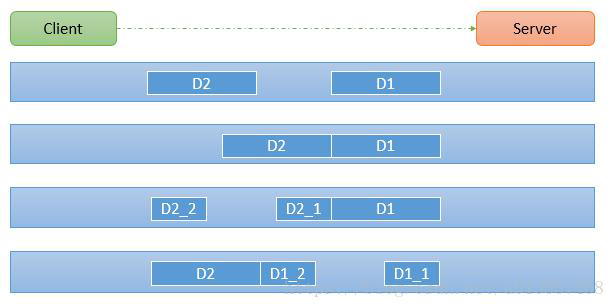

### TCP 粘包和半包以及解决方案

TCP 是面向连接的，面向流的，提供高可靠性服务。收发两端（客户端和服务器端）都要有一一成对的 socket ，因此，发送端为了将多个发给接收端的包，更有效的发给对方，使用了优化算法（ Nagle 算法），将多次间隔较小且数据量小的数据，合并成一个大的数据块，然后进行封包。这样做虽然提高了效率，但是接收端就难于分辨出完整的数据包了，因为面向流的通信是无消息保护边界的。

由于 TCP 无消息保护边界, 需要在接收端处理消息边界问题，也就是我们所说的粘包、半包问题, 如下图所示：

说明如下：

假设客户端分别发送了两个数据包 D1 和 D2 给服务端，由于服务端一次读取到字节数是不定的，故可能存在以下四种情况：

* 服务端分两次读取到了两个独立的数据分别是 D1 和 D2 ，没有粘包和半包。

* 服务端一次接受到了两个数据包，D1 和 D2 粘合在一起，称之为 TCP 粘包。

* 服务端分两次读取到了数据包，第一次取到了完整的 D1 包和 D2 包的部分内容，二次读取到了 D2 包的剩余内容，这称之 TCP 半包。

* 服务端分两次读取到了数据包，第一次取到了 D1 包的部分内容 D1_1 ，第二次读到了 D1 包的剩余部分内容 D1_2 和完整的 D2 包，这也称之 TCP 半包。

接下来实现一个案例，看看粘包和半包的问题是如何出现的，该案例就在 `demo01_problem` 包中。

为了解决粘包和半包的问题，提出如下方案：

* 使用自定义协议 + 编解码器来解决，原理就是让消息在编解码其中按照业务需求长度，分段发送。

* 关键就是要解决服务器端每次读取数据长度的问题，这个问题解决，就不会出现服务器多读或少读数据的问题，从而避免的 TCP 粘包、半包。

接下来实现一个具体的案例来体现这个解决过程，该案例就在 `demo02_solve` 包中：

1. 要求客户端发送 5 个 Message 对象, 客户端每次发送一个 Message 对象。

2. 服务器端每次接收一个 Message，分 5 次进行解码，每读取到一个 Message，会回复一个 Message 对象给客户端。
