### Netty 核心源码剖析

源码包 `io.netty.example` 已经被拷贝进了模块中。

#### Netty 启动过程源码剖析

##### 源码剖析目的

用源码分析的方式走一下 `Netty`（服务器）的启动过程，更好的理解 `Netty` 的整体设计和运行机制。

##### 源码剖析

说明：

1. 源码需要剖析到 `Netty` 调用 `doBind` 方法，追踪到 `NioServerSocketChannel` 的 `doBind`。
2. 并且要 `Debug` 程序到 `NioEventLoop` 类的 `run` 代码，无限循环，在服务器端运行。


##### 源码剖析过程

1. **`demo` 源码的基本理解**

   ```java
   import io.netty.bootstrap.ServerBootstrap;
   import io.netty.channel.ChannelFuture;
   import io.netty.channel.ChannelInitializer;
   import io.netty.channel.ChannelOption;
   import io.netty.channel.ChannelPipeline;
   import io.netty.channel.EventLoopGroup;
   import io.netty.channel.nio.NioEventLoopGroup;
   import io.netty.channel.socket.SocketChannel;
   import io.netty.channel.socket.nio.NioServerSocketChannel;
   import io.netty.handler.logging.LogLevel;
   import io.netty.handler.logging.LoggingHandler;
   import io.netty.handler.ssl.SslContext;
   import io.netty.handler.ssl.SslContextBuilder;
   import io.netty.handler.ssl.util.SelfSignedCertificate;
   
   /**
    * Echoes back any received data from a client.
    */
   public final class EchoServer {
   
       static final boolean SSL = System.getProperty("ssl") != null;
       static final int PORT = Integer.parseInt(System.getProperty("port", "8007"));
   
       public static void main(String[] args) throws Exception {
           // Configure SSL.
           final SslContext sslCtx;
           if (SSL) {
               SelfSignedCertificate ssc = new SelfSignedCertificate();
               sslCtx = SslContextBuilder.forServer(ssc.certificate(), ssc.privateKey()).build();
           } else {
               sslCtx = null;
           }
   
           // Configure the server.
           EventLoopGroup bossGroup = new NioEventLoopGroup(1);
           EventLoopGroup workerGroup = new NioEventLoopGroup();
           try {
               ServerBootstrap b = new ServerBootstrap();
               b.group(bossGroup, workerGroup)
                       .channel(NioServerSocketChannel.class)
                       .option(ChannelOption.SO_BACKLOG, 100)
                       .handler(new LoggingHandler(LogLevel.INFO))
                       .childHandler(new ChannelInitializer<SocketChannel>() {
                           @Override
                           public void initChannel(SocketChannel ch) throws Exception {
                               ChannelPipeline p = ch.pipeline();
                               if (sslCtx != null) {
                                   p.addLast(sslCtx.newHandler(ch.alloc()));
                               }
                               //p.addLast(new LoggingHandler(LogLevel.INFO));
                               p.addLast(new EchoServerHandler());
                           }
                       });
   
               // Start the server.
               ChannelFuture f = b.bind(PORT).sync();
   
               // Wait until the server socket is closed.
               f.channel().closeFuture().sync();
           } finally {
               // Shut down all event loops to terminate all threads.
               bossGroup.shutdownGracefully();
               workerGroup.shutdownGracefully();
           }
       }
   }
   ```

   说明：

   1. 先看启动类：`main` 方法中，首先创建了关于 SSL 的配置类。

   2. 重点分析下创建了两个 `EventLoopGroup` 对象：

      ```java
      EventLoopGroup bossGroup = new NioEventLoopGroup(1);
      EventLoopGroup workerGroup = new NioEventLoopGroup();
      ```

      （1）这两个对象是整个 `Netty` 的核心对象，可以说，整个 `Netty` 的运作都依赖于他们。`bossGroup` 用于接受 `TCP` 请求，他会将请求交给 `workerGroup`，`workerGroup` 会获取到真正的连接，然后和连接进行通信，比如读写解码编码等操作。

      （2）`EventLoopGroup` 是事件循环组（线程组）含有多个 `EventLoop`，可以注册 `channel`，用于在事件循环中去进行选择（和选择器相关）。【debug看】

      （3）`new NioEventLoopGroup(1);` 这个 `1` 表示 `bossGroup` 事件组有 `1` 个线程你可以指定，如果 `new NioEventLoopGroup()` 会含有默认个线程 `cpu核数 * 2`，即可以充分的利用多核的优势，【可以dubug一把】

      ```java
      DEFAULT_EVENT_LOOP_THREADS = Math.max(1, SystemPropertyUtil.getInt("io.netty.eventLoopThreads", NettyRuntime.availableProcessors() * 2));
      ```

      会创建 `EventExecutor` 数组 `children = new EventExecutor[nThreads];` // `debug` 一下每个元素的类型就是 `NIOEventLoop`，`NIOEventLoop` 实现了 `EventLoop` 接口和 `Executor` 接口 `try` 块中创建了一个 `ServerBootstrap` 对象，他是一个引导类，用于启动服务器和引导整个程序的初始化（看下源码 `allowseasybootstrapof{@linkServerChannel}`）。它和 `ServerChannel` 关联，而 `ServerChannel` 继承了 `Channel`，有一些方法 `remoteAddress` 等[可以Debug下]随后，变量 `b` 调用了 `group` 方法将两个 `group` 放入了自己的字段中，用于后期引导使用【`debug` 下 `group` 方法】

      （4）然后添加了一个 `channel`，其中参数一个 `Class` 对象，引导类将通过这个 `Class` 对象反射创建 `ChannelFactory`。然后添加了一些 `TCP` 的参数。【说明：`Channel` 的创建在 `bind` 方法，可以 `Debug` 下 `bind`，会找到 `channel = channelFactory.newChannel();` 】

      （5）再添加了一个服务器专属的日志处理器 `handler` 。

      （6）再添加一个 `SocketChannel`（不是 `ServerSocketChannel`）的 `handler`。

      （7）然后绑定端口并阻塞至连接成功。

      （8）最后 `main` 线程阻塞等待关闭。

      （9）`finally` 块中的代码将在服务器关闭时优雅关闭所有资源。

   ```java
   import io.netty.channel.ChannelHandler.Sharable;
   import io.netty.channel.ChannelHandlerContext;
   import io.netty.channel.ChannelInboundHandlerAdapter;
   
   /**
    * Handler implementation for the echo server.
    */
   @Sharable
   public class EchoServerHandler extends ChannelInboundHandlerAdapter {
   
       @Override
       public void channelRead(ChannelHandlerContext ctx, Object msg) {
           ctx.write(msg);
       }
   
       @Override
       public void channelReadComplete(ChannelHandlerContext ctx) {
           ctx.flush();
       }
   
       @Override
       public void exceptionCaught(ChannelHandlerContext ctx, Throwable cause) {
           // Close the connection when an exception is raised.
           cause.printStackTrace();
           ctx.close();
       }
   }
   ```

   说明:

   1. 这是一个普通的处理器类，用于处理客户端发送来的消息，在我们这里，我们简单的解析出客户端传过来的内容，然后打印，最后发送字符串给客户端。
   2. 大致讲解了我们的 `demo` 源码的作用。后面的 `debug` 的时候会详细。

2. **分析 EventLoopGroup 的过程**

   2.1 构造器方法

   ```java
   public NioEventLoopGroup (int nThreads) { 
       this(nThreads, (Executor) null);
   }
   ```

   2.2 上面的 `this(nThreads, (Executor) null);` 调用构造器（通过 `alt + d` 看即可）

   ```java
   public NioEventLoopGroup (int nThreads, Executor executor) {
       this(nThreads, executor, SelectorProvider.provider());
   }
   ```

   2.3 上面的 `this(nThreads, executor, SelectorProvider.provider());` 调用下面构造器

   ```java
   public NioEventLoopGroup (int nThreads, Executor executor, final SelectorProvider selectorProvider) {
       this(nThreads, executor, selectorProvider,DefaultSelectStrategyFactory.INSTANCE);
   }
   ```

   2.4 上面的 `this()...` 调用构造器（`alt + d`）

   ```java
   public NioEventLoopGroup (int nThreads, Executor executor, final SelectorProvider selectorProvider,final SelectStrategyFactory selectStrategyFactory) {
       super(nThreads, executor, selectorProvider, selectStrategyFactory, RejectedExecutionHandlers.reject());
   }
   ```

   2.5 上面的 `super()..` 的方法是父类：`MultithreadEventLoopGroup`

   ```java
   protected MultithreadEventLoopGroup (int nThreads, Executor executor, Object...args) {
       super(nThreads == 0 ? DEFAULT_EVENT_LOOP_THREADS : nThreads, executor, args);
   }
   ```

   2.6 追踪到源码抽象类 `MultithreadEventExecutorGroup` 的构造器方法 `MultithreadEventExecutorGroup` 才是 `NioEventLoopGroup` 真正的构造方法，这里可以看成是一个模板方法，使用了设计模式的模板模式（可看我录制视频），所以，我们就需要好好分析 `MultithreadEventExecutorGroup` 方法了

   2.7 分析 `MultithreadEventExecutorGroup`

   参数说明：

   - `@param nThreads` 使用的线程数，默认为 `core * 2`【可以追踪源码】
   - `@param executor` 执行器:如果传入 `null`, 则采用 `Netty` 默认的线程工厂和默认的执行器 `ThreadPerTaskExecutor`
   - `@param chooserFactory` 单例 `new DefaultEventExecutorChooserFactory()`
   - `@param args args` 在创建执行器的时候传入固定参数

   ```java
   protected MultithreadEventExecutorGroup(int nThreads, Executor executor,
                                           EventExecutorChooserFactory chooserFactory, Object... args) {
       if (nThreads <= 0) {
           throw new IllegalArgumentException(String.format("nThreads: %d (expected: > 0)", nThreads));
       }
   
       if (executor == null) { // 如果传入的执行器是空的则采用默认的线程工厂和默认的执行器
           executor = new ThreadPerTaskExecutor(newDefaultThreadFactory());
       }
   
       // 创建指定线程数的执行器数组
       children = new EventExecutor[nThreads];
   
       // 初始化线程数组
       for (int i = 0; i < nThreads; i ++) {
           boolean success = false;
           try {
               // 创建 new NioEventLoop
               children[i] = newChild(executor, args);
               success = true;
           } catch (Exception e) {
               // TODO: Think about if this is a good exception type
               throw new IllegalStateException("failed to create a child event loop", e);
           } finally {
               // 如果创建失败，优雅关闭
               if (!success) {
                   for (int j = 0; j < i; j ++) {
                       children[j].shutdownGracefully();
                   }
   
                   for (int j = 0; j < i; j ++) {
                       EventExecutor e = children[j];
                       try {
                           while (!e.isTerminated()) {
                               e.awaitTermination(Integer.MAX_VALUE, TimeUnit.SECONDS);
                           }
                       } catch (InterruptedException interrupted) {
                           // Let the caller handle the interruption.
                           Thread.currentThread().interrupt();
                           break;
                       }
                   }
               }
           }
       }
   
       chooser = chooserFactory.newChooser(children);
   
       final FutureListener<Object> terminationListener = new FutureListener<Object>() {
           @Override
           public void operationComplete(Future<Object> future) throws Exception {
               if (terminatedChildren.incrementAndGet() == children.length) {
                   terminationFuture.setSuccess(null);
               }
           }
       };
       
       // 为每一个单例线程池添加一个关闭监听器
       for (EventExecutor e: children) {
           e.terminationFuture().addListener(terminationListener);
       }
   
       Set<EventExecutor> childrenSet = new LinkedHashSet<EventExecutor>(children.length);
       //将所有的单例线程池添加到一个 HashSet 中。
       Collections.addAll(childrenSet, children);
       readonlyChildren = Collections.unmodifiableSet(childrenSet);
   }
   ```

   说明：

   1. 如果 `executor` 是 `null`，创建一个默认的 `ThreadPerTaskExecutor`，使用 `Netty` 默认的线程工厂。
   2. 根据传入的线程数（`CPU * 2`）创建一个线程池（单例线程池）数组。
   3. 循环填充数组中的元素。如果异常，则关闭所有的单例线程池。
   4. 根据线程选择工厂创建一个线程选择器。
   5. 为每一个单例线程池添加一个关闭监听器。
   6. 将所有的单例线程池添加到一个 `HashSet` 中。

3. **ServerBootstrap 创建和构造过程**

   3.1 `ServerBootstrap` 是个空构造，但是有默认的成员变量

   ```java
   private final Map<ChannelOption<?>, Object> childOptions = new LinkedHashMap<ChannelOption<?>, Object>();
   private final Map<AttributeKey<?>, Object> childAttrs = new ConcurrentHashMap<AttributeKey<?>, Object>();
   
   // config 对象，会在后面起很大作用
   private final ServerBootstrapConfig config = new ServerBootstrapConfig(this);
   private volatile EventLoopGroup childGroup;
   private volatile ChannelHandler childHandler;
   ```

   3.2 分析一下 `ServerBootstrap` 基本使用情况

   ```java
   ServerBootstrap b = new ServerBootstrap();
   b.group(bossGroup, workerGroup)
           .channel(NioServerSocketChannel.class)
           .option(ChannelOption.SO_BACKLOG, 100)
           .handler(new LoggingHandler(LogLevel.INFO))
           .childHandler(new ChannelInitializer<SocketChannel>() {
               @Override
               public void initChannel(SocketChannel ch) throws Exception {
                   ChannelPipeline p = ch.pipeline();
                   if (sslCtx != null) {
                       p.addLast(sslCtx.newHandler(ch.alloc()));
                   }
                   //p.addLast(new LoggingHandler(LogLevel.INFO));
                   p.addLast(new EchoServerHandler());
               }
           });
   ```

   说明:

   1. 链式调用：`group` 方法，将 `boss` 和 `worker` 传入，`boss` 赋值给 `parentGroup` 属性, `worker` 赋值给 `childGroup` 属性。
   2. `channel` 方法传入 `NioServerSocketChannelclass` 对象。会根据这个 `class` 创建 `channel` 对象。
   3. `option` 方法传入 `TCP` 参数，放在一个 `LinkedHashMap` 中。
   4. `handler` 方法传入一个 `handler` 中，这个 `hanlder` 只专属于 `ServerSocketChannel` 而不是 `SocketChannel`。
   5. `childHandler` 传入一个 `hanlder`，这个 `handler` 将会在每个客户端连接的时候调用。供 `SocketChannel` 使用。

4. **绑定端口的分析**

   4.1 服务器就是在这个 `bind` 方法里启动完成的 4.2 `bind` 方法代码,追踪到创建了一个端口对象，并做了一些空判断，核心代码 `doBind`，我们看看

   ```java
   public ChannelFuture bind(SocketAddress localAddress) {
       validate();
       if (localAddress == null) {
           throw new NullPointerException("localAddress");
       }
       return doBind(localAddress);
   }
   ```

   4.2`doBind` 源码剖析，核心是两个方法 `initAndRegister` 和 `doBind0`

   ```java
   private ChannelFuture doBind(final SocketAddress localAddress) {
       final ChannelFuture regFuture = initAndRegister();
       final Channel channel = regFuture.channel();
       if (regFuture.cause() != null) {
           return regFuture;
       }
   
       if (regFuture.isDone()) {
           // At this point we know that the registration was complete and successful.
           ChannelPromise promise = channel.newPromise();
           //============================================
           //说明:执行doBind0方法，完成对端口的绑定
           //============================================
           doBind0(regFuture, channel, localAddress, promise);
           return promise;
       } else {
           // Registration future is almost always fulfilled already, but just in case it's not.
           final PendingRegistrationPromise promise = new PendingRegistrationPromise(channel);
           regFuture.addListener(new ChannelFutureListener() {
               @Override
               public void operationComplete(ChannelFuture future) throws Exception {
                   Throwable cause = future.cause();
                   if (cause != null) {
                       // Registration on the EventLoop failed so fail the ChannelPromise directly to not cause an
                       // IllegalStateException once we try to access the EventLoop of the Channel.
                       promise.setFailure(cause);
                   } else {
                       // Registration was successful, so set the correct executor to use.
                       // See https://github.com/netty/netty/issues/2586
                       promise.registered();
   
                       doBind0(regFuture, channel, localAddress, promise);
                   }
               }
           });
           return promise;
       }
   }
   ```

   4.3 分析说明 `initAndRegister`

   ```java
   final ChannelFuture initAndRegister() {
       Channel channel = null;
       try {
           channel = channelFactory.newChannel();
   
           /**
            * 说明：channelFactory.newChannel() 方法的作用通过 ServerBootstrap 的通道工厂反射创建一个 NioServerSocketChannel,具体追踪源码可以得到下面结论
            * (1)通过 NIO 的 SelectorProvider 的 openServerSocketChannel 方法得到 JDK 的 channel。目的是让 Netty 包装 JDK 的 channel。
            * (2)创建了一个唯一的 ChannelId，创建了一个 NioMessageUnsafe，用于操作消息，创建了一个 DefaultChannelPipeline 管道，是个双向链表结构，用于过滤所有的进出的消息。
            * (3)创建了一个 NioServerSocketChannelConfig 对象，用于对外展示一些配置。 
            
            * channel = channelFactory.newChannel();//NioServerSocketChannel
   
            * 说明：init 初始化这个 NioServerSocketChannel，具体追踪源码可以得到如下结论
            * (1) init 方法，这是个抽象方法 (AbstractBootstrap类的），由ServerBootstrap实现（可以追一下源码//setChannelOptions(channel,options,logger);）。
            * (2)设置 NioServerSocketChannel 的 TCP 属性。
            * (3)由于 LinkedHashMap 是非线程安全的，使用同步进行处理。
            * (4)对 NioServerSocketChannel 的 ChannelPipeline 添加 ChannelInitializer 处理器。
            * (5)可以看出，init 的方法的核心作用在和 ChannelPipeline 相关。
            * (6)从 NioServerSocketChannel 的初始化过程中，我们知道，pipeline 是一个双向链表，并且，他本身就初始化了 head 和 tail，这里调用了他的 addLast 方法，也就是将整个 handler 插入到 tail 的前面，因为 tail 永远会在后面，需要做一些系统的固定工作。
            */
           init(channel);
       } catch (Throwable t) {
           if (channel != null) {
               channel.unsafe().closeForcibly();
               return new DefaultChannelPromise(channel, GlobalEventExecutor.INSTANCE).setFailure(t);
           }
           return new DefaultChannelPromise(new FailedChannel(), GlobalEventExecutor.INSTANCE).setFailure(t);
       }
   
       ChannelFuture regFuture = config().group().register(channel);
       if (regFuture.cause() != null) {
           if (channel.isRegistered()) {
               channel.close();
           } else {
               channel.unsafe().closeForcibly();
           }
       }
       return regFuture;
   }
   ```

   说明：

   1. 基本说明：`initAndRegister()` 初始化 `NioServerSocketChannel` 通道并注册各个 `handler`，返回一个 `future`。
   2. 通过 `ServerBootstrap` 的通道工厂反射创建一个 `NioServerSocketChannel`。
   3. `init` 初始化这个 `NioServerSocketChannel`。
   4. `config().group().register(channel)` 通过 `ServerBootstrap` 的 `bossGroup` 注册 `NioServerSocketChannel`。
   5. 最后，返回这个异步执行的占位符即 `regFuture`。

   4.4 `init` 方法会调用 `addLast`，现在进入到 `addLast` 方法内查看

   ```java
   @Override
   public final ChannelPipeline addLast(EventExecutorGroup group, String name, ChannelHandler handler) {
       final AbstractChannelHandlerContext newCtx;
       synchronized (this) {
           checkMultiplicity(handler);
           newCtx = newContext(group, filterName(name, handler), handler);
           addLast0(newCtx);
           if (!registered) {
               newCtx.setAddPending();
               callHandlerCallbackLater(newCtx, true);
               return this;
           }
           EventExecutor executor = newCtx.executor();
           if (!executor.inEventLoop()) {
               callHandlerAddedInEventLoop(newCtx, executor);
               return this;
           }
       }
       callHandlerAdded0(newCtx);
       return this;
   }
   ```

   说明：

   1. `addLast` 方法，在 `DefaultChannelPipeline` 类中
   2. `addLast` 方法这就是 `pipeline` 方法的核心
   3. 检查该 `handler` 是否符合标准。
   4. 创建一个 `AbstractChannelHandlerContext` 对象，这里说一下，`ChannelHandlerContext` 对象是 `ChannelHandler` 和 `ChannelPipeline` 之间的关联，每当有 `ChannelHandler` 添加到 `Pipeline` 中时，都会创建 `Context`。`Context` 的主要功能是管理他所关联的 `Handler` 和同一个 `Pipeline` 中的其他 `Handler` 之间的交互。
   5. 将 `Context` 添加到链表中。也就是追加到 `tail` 节点的前面。
   6. 最后，同步或者异步或者晚点异步的调用 `callHandlerAdded0` 方法

   4.5 前面说了 `dobind` 方法有 `2` 个重要的步骤，`initAndRegister` 说完，接下来看 `doBind0` 方法，代码如下

   ```java
   private static void doBind0(
           final ChannelFuture regFuture, final Channel channel,
           final SocketAddress localAddress, final ChannelPromise promise) {
   
       // This method is invoked before channelRegistered() is triggered.  Give user handlers a chance to set up
       // the pipeline in its channelRegistered() implementation.
       channel.eventLoop().execute(new Runnable() {
           @Override
           public void run() {
               if (regFuture.isSuccess()) {
                   //bind方法这里下断点，这里下断点，来玩!!
                   channel.bind(localAddress, promise).addListener(ChannelFutureListener.CLOSE_ON_FAILURE);
               } else {
                   promise.setFailure(regFuture.cause());
               }
           }
       });
   }
   ```

   说明：

   1. 该方法的参数为 `initAndRegister` 的 `future`，`NioServerSocketChannel`，端口地址，`NioServerSocketChannel` 的 `promise`

   2. 这里就可以根据前面下的断点，一直 `debug`：

      ```java
      // 将调用 LoggingHandler 的 invokeBind 方法,最后会追到
      // DefaultChannelPipeline 类的 bind
      // 然后进入到 unsafe.bind 方法 debug，注意要追踪到
      // unsafe.bind，要 debug 第二圈的时候，才能看到。
      
      @Override
      public void bind (ChannelHandlerContext ctx, SocketAddress localAddress, ChannelPromise promise) throws Exception {
          unsafe.bind(localAddress,promise);
      }
      
      // 继续追踪 AbstractChannel 的 
      
      public final void bind (final SocketAddress localAddress, final ChannelPromise promise) {
          //....
          try{
              //!!!! 小红旗可以看到，这里最终的方法就是 doBind 方法，执行成功后，执行通道的 fireChannelActive 方法，告诉所有的 handler，已经成功绑定。
              doBind(localAddress);//
          } catch (Throwable t) {
              safeSetFailure(promise, t);
              closeIfClosed();
              return;
          }
      }
      ```

   3. 最终 `doBind` 就会追踪到 `NioServerSocketChannel` 的 `doBind`，说明 `Netty` 底层使用的是 `NIO`

      ```java
      @Override
      protected void doBind (SocketAddress localAddress) throws Exception {
          if (PlatformDependent.javaVersion() >= 7) {
              javaChannel().bind(localAddress, config.getBacklog());
          } else {
              javaChannel().socket().bind(localAddress, config.getBacklog());
          }
      }
      ```

   4. 回到 `bind` 方法（`alt + v`），最后一步：`safeSetSuccess(promise)`，告诉 `promise` 任务成功了。其可以执行监听器的方法了。到此整个启动过程已经结束了，ok 了

   5. 继续 `atl + v` 服务器就回进入到（`NioEventLoop` 类）一个循环代码，进行监听

      ```java
      @Override
      protected void run() {
          for(;;) {
              try{
      
              }
          }
      }
      ```

##### ==Netty 启动过程梳理==

1. 创建 `2` 个 `EventLoopGroup` 线程池数组。数组默认大小 `CPU * 2`，方便 `chooser` 选择线程池时提高性能
2. `BootStrap` 将 `boss` 设置为 `group` 属性，将 `worker` 设置为 `childer` 属性
3. 通过 `bind` 方法启动，内部重要方法为 `initAndRegister` 和 `dobind` 方法
4. `initAndRegister` 方法会反射创建 `NioServerSocketChannel` 及其相关的 `NIO` 的对象，`pipeline`，`unsafe`，同时也为 `pipeline` 初始了 `head` 节点和 `tail` 节点。
5. 在 `register0` 方法成功以后调用在 `dobind` 方法中调用 `doBind0` 方法，该方法会调用 `NioServerSocketChannel` 的 `doBind` 方法对 `JDK` 的 `channel` 和端口进行绑定，完成 `Netty` 服务器的所有启动，并开始监听连接事件。

#### Netty 接受请求过程源码剖析

##### 源码剖析目的

1. 服务器启动后肯定是要接受客户端请求并返回客户端想要的信息的，下面源码分析 `Netty` 在启动之后是如何接受客户端请求的
2. 在 `io.netty.example` 包下

##### 源码剖析

说明：

1. 从之前服务器启动的源码中，我们得知，服务器最终注册了一个 `Accept` 事件等待客户端的连接。我们也知道，`NioServerSocketChannel` 将自己注册到了 `boss` 单例线程池（`reactor` 线程）上，也就是 `EventLoop`。

2. 先简单说下 `EventLoop` 的逻辑(后面我们详细讲解 `EventLoop`)

   `EventLoop` 的作用是一个死循环，而这个循环中做 3 件事情：

   1. 有条件的等待 `NIO` 事件。
   2. 处理 `NIO` 事件。
   3. 处理消息队列中的任务。
   4. 仍用前面的项目来分析：进入到 `NioEventLoop` 源码中后，在 `private void processSelectedKey(SelectionKey k, AbstractNioChannel ch)` 方法开始调试最终我们要分析到 `AbstractNioChannel` 的 `doBeginRead` 方法，当到这个方法时，针对于这个客户端的连接就完成了，接下来就可以监听读事件了

##### 源码分析过程

1. 断点位置 `NioEventLoop` 的如下方法 `processSelectedKey`

   ```java
   if((readyOps & (SelectionKey.OP_READ | SelectionKey.OP_ACCEPT)) != 0 || readyOps == 0) {
       unsafe.read();//断点位置
   }
   ```

2. 执行浏览器 `http://localhost:8007/` ，客户端发出请求

3. 从的断点我们可以看到，`readyOps` 是 `16`，也就是 `Accept` 事件。说明浏览器的请求已经进来了。

4. 这个 `unsafe` 是 `boss` 线程中 `NioServerSocketChannel` 的 `AbstractNioMessageChannel$NioMessageUnsafe` 对象。我们进入到 `AbstractNioMessageChannel$NioMessageUnsafe` 的 `read` 方法中

5. `read` 方法代码并分析:

   ```java
   @Override
   public void read() {
       asserteventLoop().inEventLoop();
       final ChannelConfig config = config();
       final ChannelPipeline pipeline = pipeline();
       final RecvByteBufAllocator.Handle allocHandle = unsafe().recvBufAllocHandle();
       allocHandle.reset(config);
       booleanclosed = false;
       Throwable exception = null;
       try {
           try {
               do {
                   int localRead = doReadMessages(readBuf);
                   if (localRead == 0) {
                       break;
                   }
                   if (localRead < 0) {
                       closed = true;
                       break;
                   }
                   
                   allocHandle.incMessagesRead(localRead);
               } while (allocHandle.continueReading());
           } catch (Throwable t) {
               exception = t;
           }
           
           int size = readBuf.size();
           for (int i = 0; i < size; i++) {
               readPending = false;
               pipeline.fireChannelRead(readBuf.get(i));
           }
           readBuf.clear();
           allocHandle.readComplete();
           pipeline.fireChannelReadComplete();
           
           if (exception != null) {
               closed = closeOnReadError(exception);
   
               pipeline.fireExceptionCaught(exception);
           }
           
           if (closed) {
               inputShutdown = true;
               if(isOpen()) {
                   close(voidPromise());
               }
           }
       } finally {
           //Check if there is a readPending which was not processed yet.
           //This could be for two reasons:
           //* The user called Channel.read() or ChannelHandlerContext.read() in channelRead(...) method
           //* The user called Channel.read() or ChannelHandlerContext.read() in channelReadComplete(...) method
           //
           // See https://github.com/netty/netty/issues/2254
           if (!readPending && !config.isAutoRead()) {
               removeReadOp();
           }
       }
   }
   ```

   说明：

   （1）检查该 `eventloop` 线程是否是当前线程。`asserteventLoop().inEventLoop()`

   （2）执行 `doReadMessages` 方法，并传入一个 `readBuf` 变量，这个变量是一个 `List`，也就是容器。

   （3）循环容器，执行 `pipeline.fireChannelRead(readBuf.get(i));`

   （4）`doReadMessages` 是读取 `boss` 线程中的 `NioServerSocketChannel` 接受到的请求。并把这些请求放进容器，一会我们 `debug` 下 `doReadMessages` 方法。

   （5）循环遍历容器中的所有请求，调用 `pipeline` 的 `fireChannelRead` 方法，用于处理这些接受的请求或者其他事件，在 `read` 方法中，循环调用 `ServerSocket` 的 `pipeline` 的 `fireChannelRead` 方法,开始执行管道中的 `handler` 的 `ChannelRead` 方法（`debug` 进入）

6. 追踪一下 `doReadMessages` 方法，就可以看得更清晰

   ```java
   protected int doReadMessages (List<Object> buf) throws Exception {
       SocketChannel ch = SocketUtils.accept(javaChannel());
       buf.add(newNioSocketChannel(this, ch));
       return 1;
   }
   ```

   说明：

   （1）通过工具类，调用 `NioServerSocketChannel` 内部封装的 `serverSocketChannel` 的 `accept` 方法，这是 `NIO` 做法。

   （2）获取到一个 `JDK` 的 `SocketChannel`，然后，使用 `NioSocketChannel` 进行封装。最后添加到容器中

   （3）这样容器 `buf` 中就有了 `NioSocketChannel` 【如果有兴趣可以追一下 `NioSocketChannel` 是如何创建的，我就不追了】

7. 回到 `read` 方法，继续分析循环执行 `pipeline.fireChannelRead` 方法

   （1）前面分析 `doReadMessages` 方法的作用是通过 `ServerSocket` 的 `accept` 方法获取到 `TCP` 连接，然后封装成 `Netty` 的 `NioSocketChannel` 对象。最后添加到容器中

   （2）在 `read` 方法中，循环调用 `ServerSocket` 的 `pipeline` 的 `fireChannelRead` 方法,开始执行管道中的 `handler` 的 `ChannelRead` 方法（`debug` 进入）

   （3）经过 `dubug`（多次），可以看到会反复执行多个 `handler` 的 `ChannelRead`，我们知道，`pipeline` 里面又 `4` 个 `handler`，分别是 `Head`，`LoggingHandler`，`ServerBootstrapAcceptor`，`Tail`。

   （4）我们重点看看 `ServerBootstrapAcceptor`。`debug` 之后，断点会进入到 `ServerBootstrapAcceptor` 中来。我们来看看 `ServerBootstrapAcceptor` 的 `channelRead` 方法（要多次 `debug` 才可以）

   （5）`channelRead` 方法

   ```java
   public void channelRead (ChannelHandlerContext ctx, Object msg) {
       final Channelchild = (Channel)msg;
       child.pipeline().addLast(childHandler);
       setChannelOptions(child, childOptions, logger);
       for (Entry<AttributeKey<?>, Object> e : childAttrs) {
           child.attr((AttributeKey<Object>)e.getKey()).set(e.getValue());
       }
       try {//将客户端连接注册到 worker 线程池
           childGroup.register(child).addListener(new ChannelFutureListener() {
               @Override
               public void operationComplete(ChannelFuturefuture) throws Exception {
                   if (!future.isSuccess()) {
                       forceClose(child, future.cause());
                   }
               }
           });
       } catch (Throwable t) {
           forceClose(child, t);
       }
   }
   ```

   说明：

   （1）`msg` 强转成 `Channel`，实际上就是 `NioSocketChannel`。

   （2）添加 `NioSocketChannel` 的 `pipeline` 的 `handler`，就是我们 `main` 方法里面设置的 `childHandler` 方法里的。

   （3）设置 `NioSocketChannel` 的各种属性。

   （4）将该 `NioSocketChannel` 注册到 `childGroup` 中的一个 `EventLoop` 上，并添加一个监听器。

   （5）这个 `childGroup` 就是我们 `main` 方法创建的数组 `workerGroup`。

8. 进入 `register` 方法查看(步步追踪会到)

   ```java
   @Override
   public final void register (EventLoop eventLoop, final ChannelPromise promise) {
       AbstractChannel.this.eventLoop = eventLoop;
       if (eventLoop.inEventLoop()) {
           register0(promise);
       } else {
           eventLoop.execute(new Runnable(){
               @Override
               public void run() {
                   register0(promise);//进入到这里
               }
           });
       }
   }
   
   // 继续进入到下面方法，执行管道中可能存在的任务,这里我们就不追了
   ```

9. 最终会调用 `doBeginRead` 方法，也就是 `AbstractNioChannel` 类的方法

   ```java
   @Override
   protected void doBeginRead() throws Exception {
       //Channel.read() or ChannelHandlerContext.read() was called
       final SelectionKey selectionKey = this.selectionKey;//断点
       if (!selectionKey.isValid()) {
           return;
       }
       readPending = true;
       final int interestOps = selectionKey.interestOps();
       if ((interestOps&readInterestOp) == 0) {
           selectionKey.interestOps(interestOps | readInterestOp);
       }
   }
   ```

10. 这个地方调试时，请把前面的断点都去掉，然后启动服务器就会停止在 `doBeginRead`（需要先放过该断点，然后浏览器请求，才能看到效果）

11. 执行到这里时，针对于这个客户端的连接就完成了，接下来就可以监听读事件了

##### ==Netty 接受请求过程梳理==

总体流程：接受连接 --> 创建一个新的 `NioSocketChannel` --> 注册到一个 `workerEventLoop` 上 --> 注册 `selecotRead` 事件。

1. 服务器轮询 `Accept` 事件，获取事件后调用 `unsafe` 的 `read` 方法，这个 `unsafe` 是 `ServerSocket` 的内部类，该方法内部由 `2` 部分组成
2. `doReadMessages` 用于创建 `NioSocketChannel` 对象，该对象包装 `JDK` 的 `NioChannel` 客户端。该方法会像创建 `ServerSocketChanel` 类似创建相关的 `pipeline`，`unsafe`，`config`
3. 随后执行执行 `pipeline.fireChannelRead` 方法，并将自己绑定到一个 `chooser` 选择器选择的 `workerGroup` 中的一个 `EventLoop`。并且注册一个 `0`，表示注册成功，但并没有注册读（1）事件

#### Pipeline Handler HandlerContext 创建源码剖析

##### 源码剖析目的

`Netty` 中的 `ChannelPipeline`、`ChannelHandler` 和 `ChannelHandlerContext` 是非常核心的组件，我们从源码来分析 `Netty` 是如何设计这三个核心组件的，并分析是如何创建和协调工作的.

##### 源码剖析

说明：分析过程中，有很多的图形，所以我们准备了一个文档，在文档的基础上来做源码剖析

##### 源码剖析过程

1. **ChannelPipeline | ChannelHandler | ChannelHandlerContext介绍**

   1. 三者关系

      （1）每当 `ServerSocket` 创建一个新的连接，就会创建一个 `Socket`，对应的就是目标客户端。

      （2）每一个新创建的 `Socket` 都将会分配一个全新的 `ChannelPipeline`（以下简称 `pipeline`）

      （3）每一个 `ChannelPipeline` 内部都含有多个 `ChannelHandlerContext`（以下简称 `Context`）

      （4）他们一起组成了双向链表，这些 `Context` 用于包装我们调用 `addLast` 方法时添加的 `ChannelHandler`（以下简称 `handler`）

      

      （5）上图中：`ChannelSocket` 和 `ChannelPipeline` 是一对一的关联关系，而 `pipeline` 内部的多个 `Context` 形成了链表，`Context` 只是对 `Handler` 的封装。 2)当一个请求进来的时候，会进入 `Socket` 对应的 `pipeline`，并经过 `pipeline` 所有的 `handler`，对，就是设计模式中的过滤器模式。

   2. ChannelPipeline 作用及设计

      （1）`pipeline` 的接口设计

      

      部分源码：

      

      可以看到该接口继承了 `inBound`，`outBound`，`Iterable` 接口，表示他可以调用数据出站的方法和入站的方法，同时也能遍历内部的链表，看看他的几个代表性的方法，基本上都是针对 `handler` 链表的插入，追加，删除，替换操作，类似是一个 `LinkedList`。同时，也能返回 `channel`（也就是 `socket`）

      （2）在 `pipeline` 的接口文档上，提供了一幅图：

      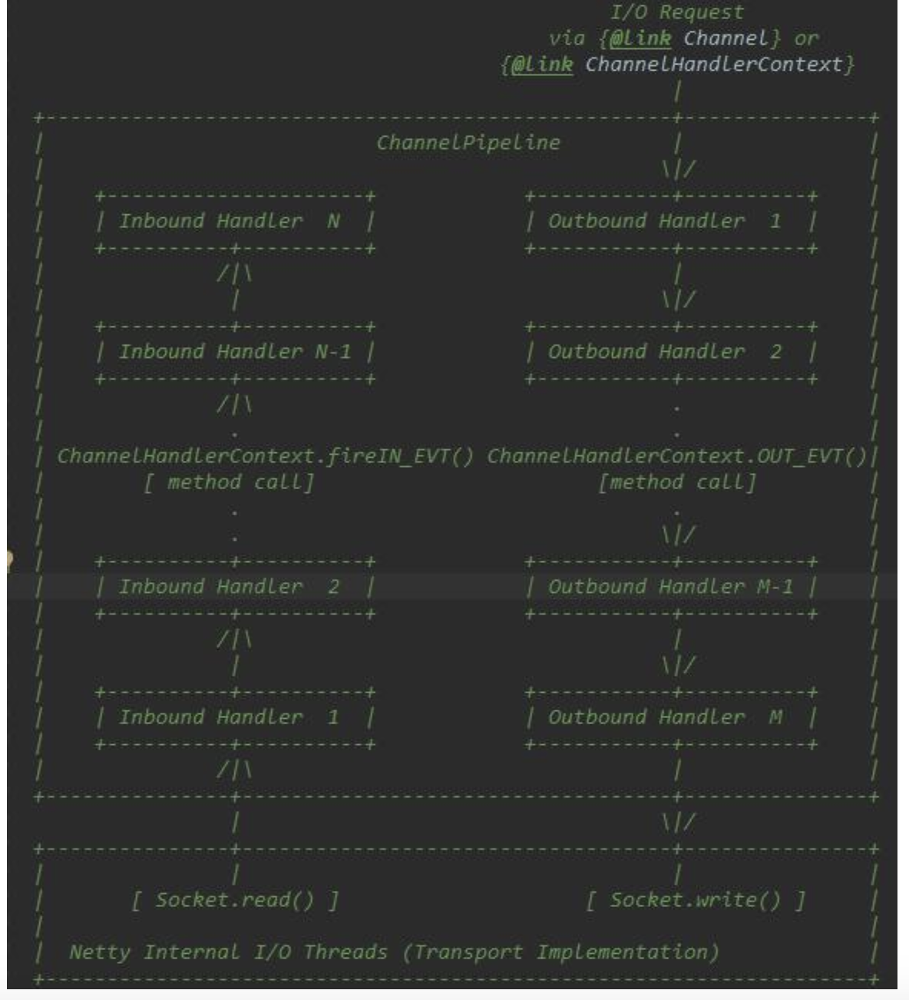

      对上图的解释说明： 

      * 这是一个 `handler` 的 `list`，`handler` 用于处理或拦截入站事件和出站事件，`pipeline` 实现了过滤器的高级形式，以便用户控制事件如何处理以及 `handler` 在 `pipeline` 中如何交互。

      * 上图描述了一个典型的 `handler` 在 `pipeline` 中处理 `I/O` 事件的方式，`IO` 事件由 `inboundHandler` 或者 `outBoundHandler` 处理，并通过调用 `ChannelHandlerContext.fireChannelRead` 方法转发给其最近的处理程序。

      * 入站事件由入站处理程序以自下而上的方向处理，如图所示。入站处理程序通常处理由图底部的 `I/O` 线程生成入站数据。入站数据通常从如 `SocketChannel.read(ByteBuffer)` 获取。

      * 通常一个 `pipeline` 有多个 `handler`，例如，一个典型的服务器在每个通道的管道中都会有以下处理程序协议解码器-将二进制数据转换为 `Java` 对象。协议编码器-将 `Java` 对象转换为二进制数据。业务逻辑处理程序-执行实际业务逻辑（例如数据库访问）

      * 你的业务程序不能将线程阻塞，会影响 `IO` 的速度，进而影响整个 `Netty` 程序的性能。如果你的业务程序很快，就可以放在 `IO` 线程中，反之，你需要异步执行。或者在添加 `handler` 的时候添加一个线程池，例如：

        ```java
        // 下面这个任务执行的时候，将不会阻塞 IO 线程，执行的线程来自 group 线程池
        
        pipeline.addLast(group, "handler", new MyBusinessLogicHandler());
        ```

   3. `ChannelHandler` 作用及设计

      （1）源码：

      ```java
      public interface ChannelHandler {
          //当把 ChannelHandler 添加到 pipeline 时被调用
          void handlerAdded(ChannelHandlerContext ctx) throws Exception;
          //当从 pipeline 中移除时调用
          void handlerRemoved(ChannelHandlerContext ctx) throws Exception;
          //当处理过程中在 pipeline 发生异常时调用
          @Deprecated
          void exceptionCaught(ChannelHandlerContext ctx, Throwable cause) throws Exception;
      }
      ```

      （2）ChannelHandler` 的作用就是处理 `IO` 事件或拦截 `IO` 事件，并将其转发给下一个处理程序 `ChannelHandler`。`Handler` 处理事件时分入站和出站的，两个方向的操作都是不同的，因此，`Netty` 定义了两个子接口继承 `ChannelHandler

      （3）`ChannelInboundHandler` 入站事件接口

      

      - `channelActive` 用于当 `Channel` 处于活动状态时被调用；
      - `channelRead` 当从 `Channel` 读取数据时被调用等等方法。
      - 程序员需要重写一些方法，当发生关注的事件，需要在方法中实现我们的业务逻辑，因为当事件发生时，`Netty` 会回调对应的方法。

      （4）`ChannelOutboundHandler` 出站事件接口

      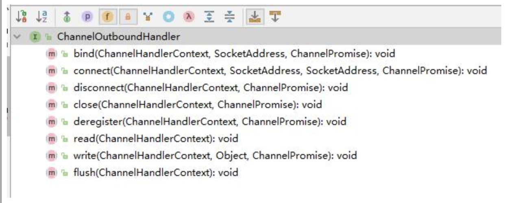

      - `bind` 方法，当请求将 `Channel` 绑定到本地地址时调用
      - `close` 方法，当请求关闭 `Channel` 时调用等等
      - 出站操作都是一些连接和写出数据类似的方法

      （5）`ChannelDuplexHandler` 处理出站和入站事件

      

      - `ChannelDuplexHandler` 间接实现了入站接口并直接实现了出站接口。
      - 是一个通用的能够同时处理入站事件和出站事件的类。

   4. `ChannelHandlerContext` 作用及设计

      （1）`ChannelHandlerContext` `UML` 图：

      

      `ChannelHandlerContext` 继承了出站方法调用接口和入站方法调用接口

      （2）`ChannelOutboundInvoker` 和 `ChannelInboundInvoker` 部分源码

      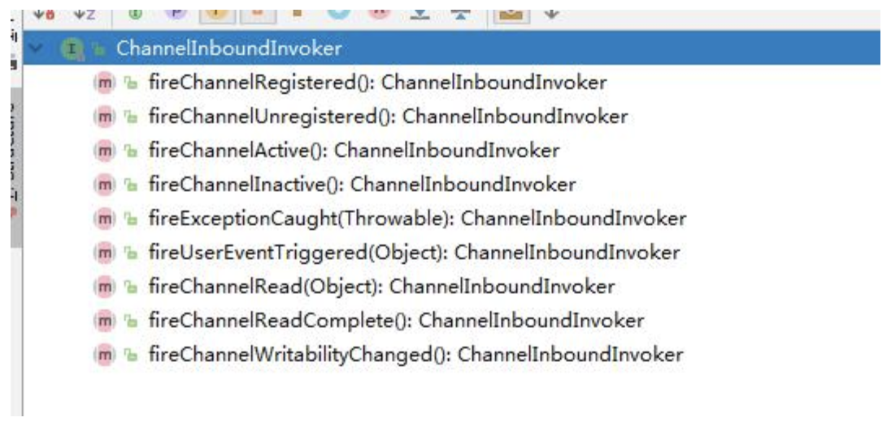

      

      - 这两个 `invoker` 就是针对入站或出站方法来的，就是在入站或出站 `handler` 的外层再包装一层，达到在方法前后拦截并做一些特定操作的目的

      （3）`ChannelHandlerContext` 部分源码

      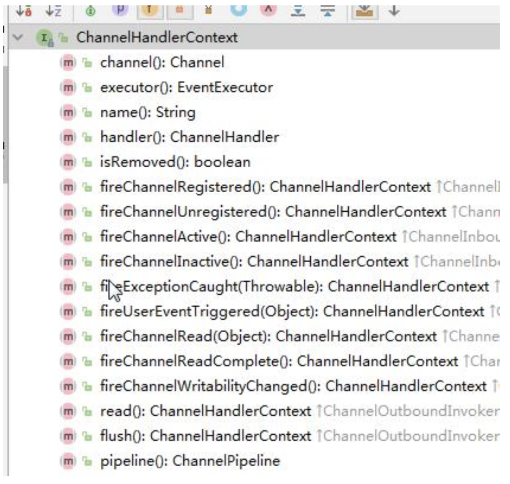

      - `ChannelHandlerContext` 不仅仅时继承了他们两个的方法，同时也定义了一些自己的方法
      - 这些方法能够获取 `Context` 上下文环境中对应的比如 `channel`，`executor`，`handler`，`pipeline`，内存分配器，关联的 `handler` 是否被删除。
      - `Context` 就是包装了 `handler` 相关的一切，以方便 `Context` 可以在 `pipeline` 方便的操作 `handler`

2. **ChannelPipeline | ChannelHandler | ChannelHandlerContext创建过程**

   创建过程分为 `3` 个步骤来看创建的过程：

   - 任何一个 `ChannelSocket` 创建的同时都会创建一个 `pipeline`。
   - 当用户或系统内部调用 `pipeline` 的 `add`
   - 方法添加 `handler` 时，都会创建一个包装这 `handler` 的 `Context`。
   - 这些 `Context` 在 `pipeline` 中组成了双向链表。

   接下来详细探讨一下这三个组件的创建过程

   1. `Socket` 创建的时候创建 `pipeline` 在 `SocketChannel` 的抽象父类 `AbstractChannel` 的构造方法中

      ```java
      protected AbstractChannel(Channel parent) {
          this.parent=parent;//断点测试
          id = newId();
          unsafe = new Unsafe();
          pipeline = new ChannelPipeline();
      }
      ```

      `Debug` 一下，可以看到代码会执行到这里，然后继续追踪到

      ```java
      protected DefaultChannelPipeline(Channel channel) {
          this.channel = ObjectUtil.checkNotNull(channel, "channel");
          succeededFuture = new SucceededChannelFuture(channel, null);
          voidPromise = new VoidChannelPromise(channel, true);
          tail = new TailContext(this);
          head = new HeadContext(this);
          head.next = tail;
          tail.prev = head;
      }
      ```

      说明：

      （1）将 `channel` 赋值给 `channel` 字段，用于 `pipeline` 操作 `channel`。

      （2）创建一个 `future` 和 `promise`，用于异步回调使用。

      （3）创建一个 `inbound` 的 `tailContext`，创建一个既是 `inbound` 类型又是 `outbound` 类型的 `headContext`。

      （4）最后，将两个 `Context` 互相连接，形成双向链表。

      （5）`tailContext` 和 `HeadContext` 非常的重要，所有 `pipeline` 中的事件都会流经他们。

   2. 在 add添加处理器的时候创建Context看下 `DefaultChannelPipeline` 的 `addLast` 方法如何创建的 `Context`，代码如下

      ```java
      @Override
      public final ChannelPipeline addLast(EventExecutorGroup executor, ChannelHandler... handlers) {
          if (handlers == null) {//断点
              throw new NullPointerException("handlers");
          }
          for (ChannelHandler h : handlers) {
              if (h == null) {
                  break;
              }
              addLast(executor, null, h);
          }
          return this;
      }
      ```

      继续 Debug

      ```java
      public final ChannelPipeline addLast(EventExecutorGroup group, String name, ChannelHandler handler) {
          final AbstractChannelHandlerContext newCtx;
          synchronized(this) {
              checkMultiplicity(handler);
      
              newCtx = newContext(group, filterName(name, handler), handler);
              addLast0(newCtx);
              //If the registered is false it means that the channel was not registered on an eventloop yet.
              //In this case we add the context to the pipeline and add a task that will call
              //ChannelHandler.handlerAdded(...) once the channel is registered.
              if (!registered) {
                  newCtx.setAddPending();
                  callHandlerCallbackLater(newCtx, true);
                  return this;
              }
      
              EventExecutor executor = newCtx.executor();
              if (!executor.inEventLoop()) {
                  newCtx.setAddPending();
                  executor.execute(new Runnable() {
                      @Override
                      public void run () {
                          callHandlerAdded0(newCtx);
                      }
                  });
                  return this;
              }
          }
          callHandlerAdded0(newCtx);
          return this;
      }
      ```

      说明：

      （1）`pipeline` 添加 `handler`，参数是线程池，`name` 是 `null`，`handler` 是我们或者系统传入的 `handler`。`Netty` 为了防止多个线程导致安全问题，同步了这段代码，步骤如下：

      （2）检查这个 `handler` 实例是否是共享的，如果不是，并且已经被别的 `pipeline` 使用了，则抛出异常。

      （3）调用 `new Context(group, filterName(name, handler), handler)` 方法，创建一个 `Context`。从这里可以看出来了，每次添加一个 `handler` 都会创建一个关联 `Context`。

      （4）调用 `addLast` 方法，将 `Context` 追加到链表中。

      （5）如果这个通道还没有注册到 `selecor` 上，就将这个 `Context` 添加到这个 `pipeline` 的待办任务中。当注册好了以后，就会调用 `callHandlerAdded0` 方法（默认是什么都不做，用户可以实现这个方法）。

      （6）到这里，针对三对象创建过程，了解的差不多了，和最初说的一样，每当创建 `ChannelSocket` 的时候都会创建一个绑定的 `pipeline`，一对一的关系，创建 `pipeline` 的时候也会创建 `tail` 节点和 `head` 节点，形成最初的链表。`tail` 是入站 `inbound` 类型的 `handler`，`head` 既是 `inbound` 也是 `outbound` 类型的 `handler`。在调用 `pipeline` 的 `addLast` 方法的时候，会根据给定的 `handler` 创建一个 `Context`，然后，将这个 `Context` 插入到链表的尾端（`tail` 前面）。到此就 `OK` 了。

##### ==Pipeline Handler HandlerContext 创建过程梳理==

1. 每当创建 `ChannelSocket` 的时候都会创建一个绑定的 `pipeline`，一对一的关系，创建 `pipeline` 的时候也会创建 `tail` 节点和 `head` 节点，形成最初的链表。
2. 在调用 `pipeline` 的 `addLast` 方法的时候，会根据给定的 `handler` 创建一个 `Context`，然后，将这个 `Context` 插入到链表的尾端（`tail` 前面）。
3. `Context` 包装 `handler`，多个 `Context` 在 `pipeline` 中形成了双向链表
4. 入站方向叫 `inbound`，由 `head` 节点开始，出站方法叫 `outbound`，由 `tail` 节点开始

#### ChannelPipeline 调度 handler 的源码剖析

##### 源码剖析目的

1. 当一个请求进来的时候，`ChannelPipeline` 是如何调用内部的这些 `handler` 的呢？我们一起来分析下。
2. 首先，当一个请求进来的时候，会第一个调用 `pipeline` 的相关方法，如果是入站事件，这些方法由 `fire` 开头，表示开始管道的流动。让后面的 `handler` 继续处理

##### 源码剖析

说明：当浏览器输入 `http://localhost:8007` 。可以看到会执行 `handler` 在 `Debug` 时，可以将断点下在 `DefaultChannelPipeline` 类的

```java
public final ChannelPipeline fireChannelActive() {
    AbstractChannelHandlerContext.invokeChannelActive(head);//断点
    return this;
}
```

##### 源码分析过程

1. `DefaultChannelPipeline` 是如何实现这些 `fire` 方法的 3.1 `DefaultChannelPipeline` 源码

   ```java
   public class DefaultChannelPipeline implements ChannelPipeline {
       @Override
       public final ChannelPipeline fireChannelActive() {
           AbstractChannelHandlerContext.invokeChannelActive(head);
           return this;
       }
       
       @Override
       public final ChannelPipelinefireChannelInactive() {
           AbstractChannelHandlerContext.invokeChannelInactive(head);
           return this;
       }
       
       @Override
       public final ChannelPipeline fireExceptionCaught(Throwable cause) {
           AbstractChannelHandlerContext.invokeExceptionCaught(head, cause);
           return this;
       }
       
       @Override
       public final ChannelPipeline fireUserEventTriggered(Object event) {
           AbstractChannelHandlerContext.invokeUserEventTriggered(head, event);
           return this;
       }
       
       @Override
       public final ChannelPipeline fireChannelRead(Objectmsg) {
           AbstractChannelHandlerContext.invokeChannelRead(head, msg);
           return this;
       }
       
       @Override
       public final ChannelPipeline fireChannelReadComplete() {
           AbstractChannelHandlerContext.invokeChannelReadComplete(head);
           return this;
       }
       
       @Override
       public final ChannelPipeline fireChannelWritabilityChanged() {
           AbstractChannelHandlerContext.invokeChannelWritabilityChanged(head);
           return this;
       }
   }
   ```

   说明： 可以看出来，这些方法都是 `inbound` 的方法，也就是入站事件，调用静态方法传入的也是 `inbound` 的类型 `head` `handler`。这些静态方法则会调用 `head` 的 `ChannelInboundInvoker` 接口的方法，再然后调用 `handler` 的真正方法

2. 再看下 `piepline` 的 `outbound` 的 `fire` 方法实现源码

   ```java
   public class DefaultChannelPipeline implements ChannelPipeline {
       @Override
       public final ChannelFuture bind(SocketAddress localAddress) {
           return tail.bind(localAddress);
       }
       
       @Override
       public final ChannelFuture connect(SocketAddress remoteAddress) {
           return tail.connect(remoteAddress);
       }
       
       @Override
       public final ChannelFuture connect(SocketAddress remoteAddress, SocketAddress localAddress) {
           return tail.connect(remoteAddress, localAddress);
       }
       
       @Override
       public final ChannelFuture disconnect(){
           return tail.disconnect();
       }
       
       @Override
       public final ChannelFuture close() {
           return tail.close();
       }
       
       @Override
       public final ChannelFuture deregister() {
           return tail.deregister();
       }
       
       @Override
       public final ChannelPipeline flush() {
           tail.flush();
           return this;
       }
       
       @Override
       public final ChannelFuture bind(SocketAddress localAddress, ChannelPromise promise) {
           return tail.bind(localAddress, promise);
       }
       
       @Override
       public final ChannelFuture connect(SocketAddress remoteAddress, ChannelPromise promise) {
           return tail.connect(remoteAddress, promise);
       }
       
       @Override
       public final ChannelFuture connect(SocketAddress remoteAddress, SocketAddress localAddress, ChannelPromise promise) {
           return tail.connect(remoteAddress, localAddress, promise);
       }
       
       @Override
       public final ChannelFuture disconnect(ChannelPromise promise) {
           return tail.disconnect(promise);
       }
   }
   ```

   说明：

   （1）这些都是出站的实现，但是调用的是 `outbound` 类型的 `tailhandler` 来进行处理，因为这些都是 `outbound` 事件。

   （2）出站是 `tail` 开始，入站从 `head` 开始。因为出站是从内部向外面写，从 `tail` 开始，能够让前面的 `handler` 进行处理，防止 `handler` 被遗漏，比如编码。反之，入站当然是从 `head` 往内部输入，让后面的 `handler` 能够处理这些输入的数据。比如解码。因此虽然 `head` 也实现了 `outbound` 接口，但不是从 head 开始执行出站任务

3. 关于如何调度，用一张图来表示：

   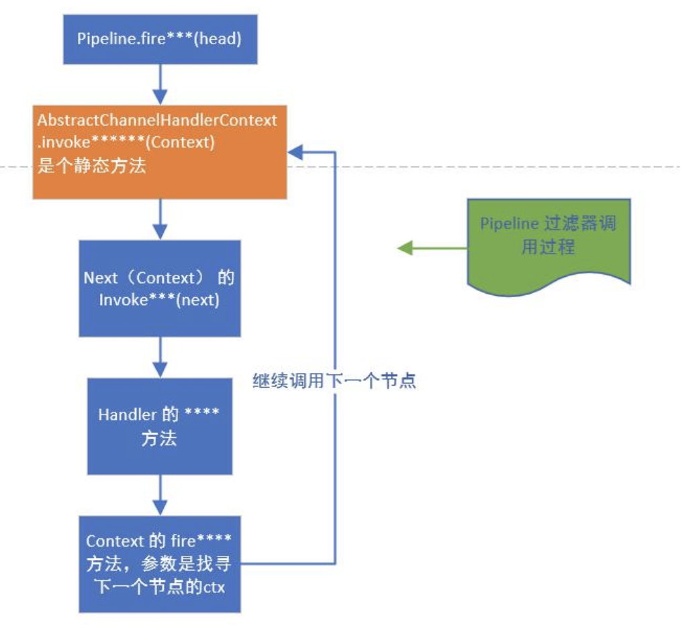

   说明： 

   （1）`pipeline` 首先会调用 `Context` 的静态方法 `fireXXX`，并传入 `Context`

   （2）然后，静态方法调用 `Context` 的 `invoker` 方法，而 `invoker` 方法内部会调用该 `Context` 所包含的 `Handler` 的真正的 `XXX` 方法，调用结束后，如果还需要继续向后传递，就调用 `Context` 的 `fireXXX2` 方法，循环往复。

##### ==ChannelPipeline 调度 handler 梳理==

1. `Context` 包装 `handler`，多个 `Context` 在 `pipeline` 中形成了双向链表，入站方向叫 `inbound`，由 `head` 节点开始，出站方法叫 `outbound`，由 `tail` 节点开始。
2. 而节点中间的传递通过 `Abstract ChannelHandlerContext` 类内部的 `fire` 系列方法，找到当前节点的下一个节点不断的循环传播。是一个过滤器形式完成对 `handler` 的调度

#### Netty 心跳(heartbeat)服务源码剖析

##### 源码剖析目的

`Netty` 作为一个网络框架，提供了诸多功能，比如编码解码等，`Netty` 还提供了非常重要的一个服务 -- 心跳机制 `heartbeat`。通过心跳检查对方是否有效，这是 `RPC` 框架中是必不可少的功能。下面我们分析一下 `Netty` 内部心跳服务源码实现。

##### 源码剖析

说明：

`Netty` 提供了 `IdleStateHandler`，`ReadTimeoutHandler`，`WriteTimeoutHandler` 三个 `Handler` 检测连接的有效性，重点分析 `IdleStateHandler`。

如图：

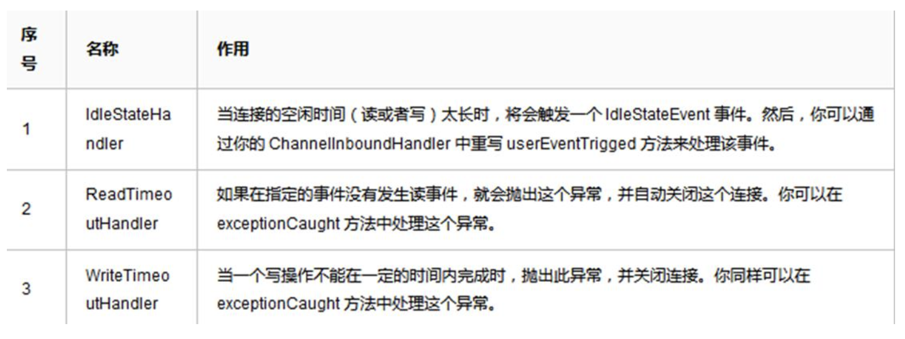

##### 源码剖析过程

1. **`Netty` 提供的心跳介绍**

   （1）`Netty` 提供了 `IdleStateHandler`，`ReadTimeoutHandler`，`WriteTimeoutHandler` 三个 `Handler` 检测连接的有效性。

   （2）如图：

   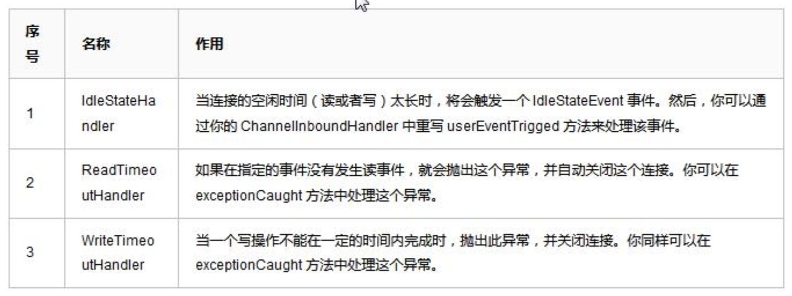

   （3）`ReadTimeout` 事件和 `WriteTimeout` 事件都会自动关闭连接，而且，属于异常处理，所以，这里只是介绍以下，我们重点看 `IdleStateHandler`。

2. **`IdleStateHandler` 分析**

   1. `4` 个属性

      ```java
      private final boolean observeOutput; //是否考虑出站时较慢的情况。默认值是 false
      
      private final long readerIdleTimeNanos; //读事件空闲时间，0 则禁用事件
      
      private final long writerIdleTimeNanos;//写事件空闲时间，0 则禁用事件
      
      private final long allIdleTimeNanos;//读或写空闲时间，0 则禁用事件
      ```

   2. `handlerAdded` 方法

      当该 `handler` 被添加到 `pipeline` 中时，则调用 `initialize` 方法

      ```java
      private void initialize(ChannelHandlerContext ctx) {
          //Avoid the case where destroy() is called before scheduling timeouts.
          //See:https://github.com/netty/netty/issues/143
          switch(state) {
              case1:
              case2:
                  return;
          }
          
          state=1;
          initOutputChanged(ctx);
          
          lastReadTime = lastWriteTime = ticksInNanos();
          
          if(readerIdleTimeNanos > 0) {
              //这里的 schedule 方法会调用 eventLoop 的 schedule 方法，将定时任务添加进队列中
              readerIdleTimeout = schedule(ctx, new ReaderIdleTimeoutTask(ctx), readerIdleTimeNanos, TimeUnit.NANOSECONDS);
          }
          
          if(writerIdleTimeNanos > 0) {
              writerIdleTimeout = schedule(ctx, new WriterIdleTimeoutTask(ctx), writerIdleTimeNanos, TimeUnit.NANOSECONDS);
          }
          
          if(allIdleTimeNanos > 0) {
              allIdleTimeout = schedule(ctx, new AllIdleTimeoutTask(ctx), allIdleTimeNanos, TimeUnit.NANOSECONDS);
          }
      }
      ```

      只要给定的参数大于 `0`，就创建一个定时任务，每个事件都创建。同时，将 `state` 状态设置为 `1`，防止重复初始化。调用 `initOutputChanged` 方法，初始化“监控出站数据属性”。

   3. 该类内部的 `3` 个定时任务类

      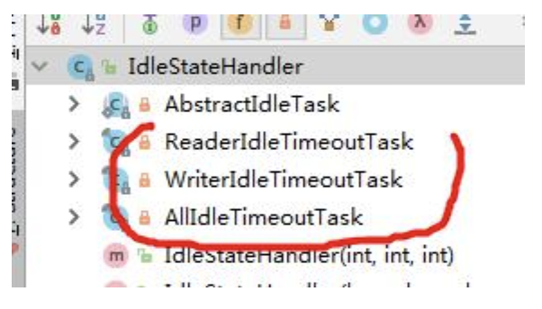

      这 `3` 个定时任务分别对应读，写，读或者写事件。共有一个父类（`AbstractIdleTask`）。这个父类提供了一个模板方法：

      ```java
      private abstract static class AbstractIdleTask implements Runnable {
          
          private final ChannelHandlerContext ctx;
          
          AbstractIdleTask(ChannelHandlerContext ctx) {
              this.ctx = ctx;
          }
          
          @Override
          public void run() {
              if(!ctx.channel().isOpen()) {
                  return;
              }
              run(ctx);
          }
          
          protected abstract void run(ChannelHandlerContext ctx);
      }
      ```

      说明：当通道关闭了，就不执行任务了。反之，执行子类的 `run` 方法

3. **读事件的 `run` 方法（即 `ReaderIdleTimeoutTask` 的 `run` 方法）分析**

   代码及其说明：

   ```java
   @Override
   protected void run(ChannelHandlerContext ctx) {
       long nextDelay = readerIdleTimeNanos;
       if(!reading) {
           nextDelay -= ticksInNanos() - lastReadTime;
       }
       
       if(nextDelay <= 0) {
           //Reader is idle-set a new timeout and notify the callback.
           //用于取消任务 promise
           readerIdleTimeout = schedule(ctx, this, readerIdleTimeNanos, TimeUnit.NANOSECONDS);
           boolean first = firstReaderIdleEvent;
           firstReaderIdleEvent = false;
           try {
               //再次提交任务
               IdleStateEvent event = new IdleStateEvent(IdleState.READER_IDLE, first);
               //触发用户 handler use
               channelIdle(ctx, event);
           } catch (Throwable t) {
               ctx.fireExceptionCaught(t);
           }
       } else {
           //Read occurred before the timeout - set a new timeout with shorter delay.
           readerIdleTimeout = schedule(ctx, this, nextDelay, TimeUnit.NANOSECONDS);
       }
   }
   ```

   说明：

   （1）得到用户设置的超时时间。

   （2）如果读取操作结束了（执行了 `channelReadComplete` 方法设置），就用当前时间减去给定时间和最后一次读（执操作的时间行了 `channelReadComplete` 方法设置），如果小于 `0`，就触发事件。反之，继续放入队列。间隔时间是新的计算时间。

   （3）触发的逻辑是：首先将任务再次放到队列，时间是刚开始设置的时间，返回一个 `promise` 对象，用于做取消操作。然后，设置 `first` 属性为`false`，表示，下一次读取不再是第一次了，这个属性在 `channelRead` 方法会被改成 `true`。

   （4）创建一个 `IdleStateEvent` 类型的写事件对象，将此对象传递给用户的 `UserEventTriggered` 方法。完成触发事件的操作。

   （5）总的来说，每次读取操作都会记录一个时间，定时任务时间到了，会计算当前时间和最后一次读的时间的间隔，如果间隔超过了设置的时间，就触发 `UserEventTriggered` 方法。//前面介绍 `IdleStateHandler` 说过,可以看一下

4. **写事件的 `run` 方法（即 `WriterIdleTimeoutTask` 的 `run` 方法）分析**

   代码及其说明：

   ```java
   @Override
   protected void run(ChannelHandlerContext ctx) {
       long lastWriteTime = IdleStateHandler.this.lastWriteTime;
       long nextDelay = writerIdleTimeNanos - (ticksInNanos()-lastWriteTime);
       if (nextDelay <=0 ) {
           //Writer is idle - set a new timeout and notify the callback.
           writerIdleTimeout = schedule(ctx, this, writerIdleTimeNanos, TimeUnit.NANOSECONDS);
           boolean first = firstWriterIdleEvent;
           firstWriterIdleEvent = false;
           try {
               if(hasOutputChanged(ctx, first)) {
                   return;
               }
               
               IdleStateEvent event = new IdleStateEvent(IdleState.WRITER_IDLE, first);
               channelIdle(ctx, event);
           } catch (Throwable t) {
               ctx.fireExceptionCaught(t);
           }
       } else {
           //Write occurred before the timeout - set a new timeout with shorter delay.
           writerIdleTimeout = schedule(ctx, this, nextDelay, TimeUnit.NANOSECONDS);
       }
   }
   ```

   说明：写任务的 `run` 代码逻辑基本和读任务的逻辑一样，唯一不同的就是有一个针对出站较慢数据的判断 `hasOutputChanged`

5. **所有事件的 `run` 方法（即 `AllIdleTimeoutTask` 的 `run` 方法）分析**

   代码及其说明：

   ```java
   @Override
   protected void run(ChannelHandlerContext ctx) {
       long nextDelay = allIdleTimeNanos;
       if(!reading) {
           nextDelay -= ticksInNanos() - Math.max(lastReadTime, lastWriteTime);
       }
       
       if(nextDelay <= 0) {
           //Both reader and writer are idle - set a new timeout and
           //notify the callback.
           allIdleTimeout = schedule(ctx, this, allIdleTimeNanos, TimeUnit.NANOSECONDS);
           boolean first = firstAllIdleEvent;
           firstAllIdleEvent = false;
           try {
               if(hasOutputChanged(ctx, first)) {
                   return;
               }
               
               IdleStateEvent event = new IdleStateEvent(IdleState.ALL_IDLE, first);
               channelIdle(ctx, event);
           } catch(Throwable t) {
               ctx.fireExceptionCaught(t);
           }
       } else {
           //Either read or write occurred before the timeout - set a new
           //timeout with shorter delay.
           allIdleTimeout = schedule(ctx, this, nextDelay, TimeUnit.NANOSECONDS);
       }
   }
   ```

   说明：

   （1）表示这个监控着所有的事件。当读写事件发生时，都会记录。代码逻辑和写事件的的基本一致：

   （2）需要大家注意的地方是：

   ```java
   long nextDelay = allIdleTimeNanos;
   if(!reading) {
       //当前时间减去最后一次写或读的时间，若大于 0，说明超时了
       nextDelay -= ticksInNanos() - Math.max(lastReadTime, lastWriteTime);
   }
   ```

   （3）这里的时间计算是取读写事件中的最大值来的。然后像写事件一样，判断是否发生了写的慢的情况。

##### ==Netty 心跳（heartbeat）服务梳理==

1. `IdleStateHandler` 可以实现心跳功能，当服务器和客户端没有任何读写交互时，并超过了给定的时间，则会触发用户 `handler` 的 `userEventTriggered` 方法。用户可以在这个方法中尝试向对方发送信息，如果发送失败，则关闭连接。
2. `IdleStateHandler` 的实现基于 `EventLoop` 的定时任务，每次读写都会记录一个值，在定时任务运行的时候，通过计算当前时间和设置时间和上次事件发生时间的结果，来判断是否空闲。
3. 内部有 `3` 个定时任务，分别对应读事件，写事件，读写事件。通常用户监听读写事件就足够了。
4. 同时，`IdleStateHandler` 内部也考虑了一些极端情况：客户端接收缓慢，一次接收数据的速度超过了设置的空闲时间。`Netty` 通过构造方法中的 `observeOutput` 属性来决定是否对出站缓冲区的情况进行判断。
5. 如果出站缓慢，`Netty` 不认为这是空闲，也就不触发空闲事件。但第一次无论如何也是要触发的。因为第一次无法判断是出站缓慢还是空闲。当然，出站缓慢的话，可能造成 `OOM`，`OOM` 比空闲的问题更大。
6. 所以，当你的应用出现了内存溢出，`OOM` 之类，并且写空闲极少发生（使用了 `observeOutput` 为 `true`），那么就需要注意是不是数据出站速度过慢。
7. 还有一个注意的地方：就是 `ReadTimeoutHandler`，它继承自 `IdleStateHandler`，当触发读空闲事件的时候，就触发 `ctx`. `fireExceptionCaught` 方法，并传入一个 `ReadTimeoutException`，然后关闭 `Socket`。
8. 而 `WriteTimeoutHandler` 的实现不是基于 `IdleStateHandler` 的，他的原理是，当调用 `write` 方法的时候，会创建一个定时任务，任务内容是根据传入的 `promise` 的完成情况来判断是否超出了写的时间。当定时任务根据指定时间开始运行，发现 `promise` 的 `isDone` 方法返回 `false`，表明还没有写完，说明超时了，则抛出异常。当 `write` 方法完成后，会打断定时任务。

#### Netty 核心组件 EventLoop 源码剖析

##### 源码剖析目的

`Echo` 第一行代码就是：`EventLoopGroup bossGroup = new NioEventLoopGroup(1)`; 下面分析其最核心的组件 `EventLoop`。

##### 源码剖析过程

1. `EventLoop`介绍 1.1首先看看 `NioEventLoop` 的继承图：

   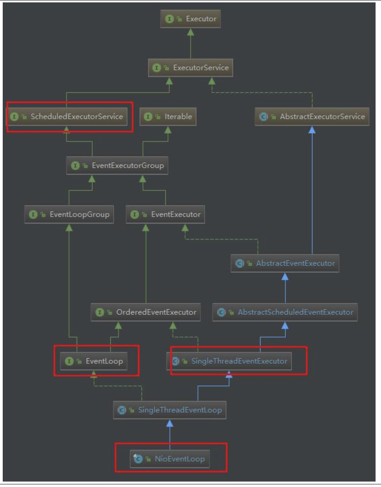

   说明重点：

   （1）`ScheduledExecutorService` 接口表示是一个定时任务接口，`EventLoop` 可以接受定时任务。

   （2）`EventLoop` 接口：`Netty` 接口文档说明该接口作用：一旦 `Channel` 注册了，就处理该 `Channel` 对应的所有 `I/O` 操作。

   （3）`SingleThreadEventExecutor` 表示这是一个单个线程的线程池

   （4）`EventLoop` 是一个单例的线程池，里面含有一个死循环的线程不断的做着 `3` 件事情：监听端口，处理端口事件，处理队列事件。每个 `EventLoop` 都可以绑定多个 `Channel`，而每个 `Channel` 始终只能由一个 `EventLoop` 来处理

2. `NioEventLoop` 的使用 - `execute` 方法

   1. `execute` 源码剖析

      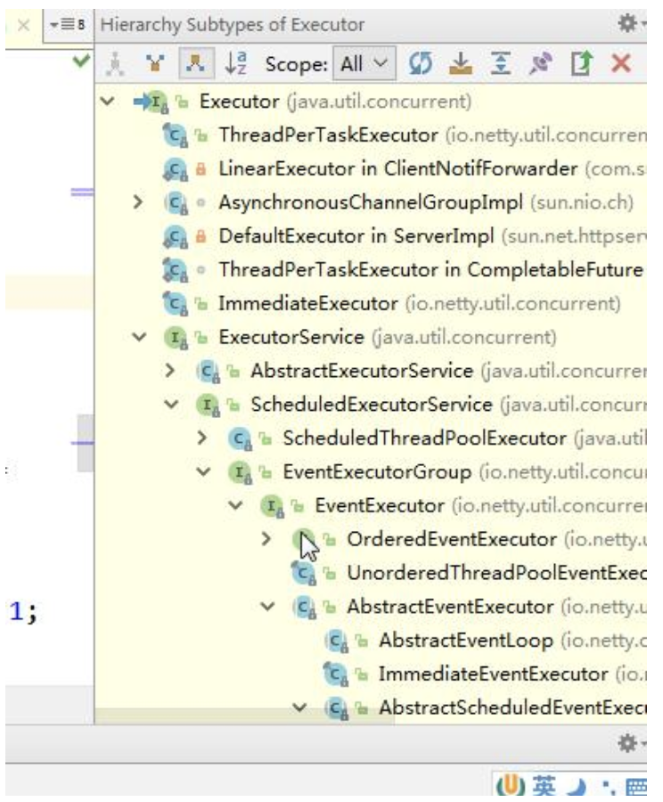

      在 `EventLoop` 的使用，一般就是 `eventloop.execute(task);` 看下 `execute` 方法的实现(在 `SingleThreadEventExecutor` 类中)

      ```java
      @Override
      public void execute(Runnable task) {
          if(task == null) {
              throw new NullPointerException("task");
          }
          boolean inEventLoop = inEventLoop();
          if(inEventLoop) {
              addTask(task);
          } else {
              startThread();
              addTask(task);
              if(isShutdown() && removeTask(task)) {
                  reject();
              }
          }
          
          if(!addTaskWakesUp&&wakesUpForTask(task)) {
              wakeup(inEventLoop);
          }
      }
      ```

      说明：

      （1）首先判断该 `EventLoop` 的线程是否是当前线程，如果是，直接添加到任务队列中去，如果不是，则尝试启动线程（但由于线程是单个的，因此只能启动一次），随后再将任务添加到队列中去。

      （2）如果线程已经停止，并且删除任务失败，则执行拒绝策略，默认是抛出异常。

      （3）如果 `addTaskWakesUp` 是 `false`，并且任务不是 `NonWakeupRunnable` 类型的，就尝试唤醒 `selector`。这个时候，阻塞在 `selecor`的线程就会立即返回

      （4）可以下断点来追踪

   2. `debugaddTask` 和 `offerTask` 方法源码

      ```java
      protected void addTask(Runnable task) {
          if(task == null) {
              throw new NullPointerException("task");
          }
          
          if(!offerTask(task)) {
              reject(task);
          }
      }
      
      final boolean offerTask(Runnable task) {
          if(isShutdown()) {
              reject();
          }
          return taskQueue.offer(task);
      }
      ```

3. `NioEventLoop` 的父类 `SingleThreadEventExecutor` 的 `startThread` 方法 3.1当执行 `execute` 方法的时候，如果当前线程不是 `EventLoop` 所属线程，则尝试启动线程，也就是 `startThread` 方法，dubug 代码如下：

   ```java
   private void startThread() {
       if(state == ST_NOT_STARTED) {
           if(STATE_UPDATER.compareAndSet(this, ST_NOT_STARTED, ST_STARTED)) {
               try{
                   doStartThread();
               } catch(Throwable cause) {
                   STATE_UPDATER.set(this, ST_NOT_STARTED);
                   PlatformDependent.throwException(cause);
               }
           }
       }
   }
   ```

   说明：该方法首先判断是否启动过了，保证 `EventLoop` 只有一个线程，如果没有启动过，则尝试使用 `Cas` 将 `state` 状态改为 `ST_STARTED`，也就是已启动。然后调用 `doStartThread` 方法。如果失败，则进行回滚。

   看下 `doStartThread` 方法：

   ```java
   private void doStartThread() {
       executor.execute(new Runnable() {
           @Override
           public void run() {
               boolean success = false;
               updateLastExecutionTime();
               try{
                   SingleThreadEventExecutor.this.run();
                   success=true;
               } finally {
                   for( ; ; ) {
                       intoldState = state;
                       if(oldState >= ST_SHUTTING_DOWN || STATE_UPDATER.compareAndSet(SingleThreadEventExecutor.this, oldState, ST_SHUTTING_DOWN)) {
                           break;
                       }
                   }
                   try {
                       for( ; ; ) {
                           if(confirmShutdown()) {
                               break;
                           }
                       }
                   } finally {
                       try {
                           cleanup();
                       } finally {
                           STATE_UPDATER.set(SingleThreadEventExecutor.this,ST_TERMINATED);
                           threadLock.release();
                           terminationFuture.setSuccess(null);
                       }
                   }
               }
           }
       });
   }
   ```

   说明：

   （1）首先调用 `executor` 的 `execute` 方法，这个 `executor` 就是在创建 `EventLoopGroup` 的时候创建的 `ThreadPerTaskExecutor` 类。该 `execute` 方法会将 `Runnable` 包装成 `Netty` 的 `FastThreadLocalThread`。

   （2）任务中，首先判断线程中断状态，然后设置最后一次的执行时间。

   （3）执行当前 `NioEventLoop` 的 `run` 方法，注意：这个方法是个死循环，是整个 `EventLoop` 的核心

   （4）在 `finally` 块中，使用 `CAS` 不断修改 `state` 状态，改成 `ST_SHUTTING_DOWN`。也就是当线程 `Loop` 结束的时候。关闭线程。最后还要死循环确认是否关闭，否则不会 `break`。然后，执行 `cleanup` 操作，更新状态为

   （5）`ST_TERMINATED`，并释放当前线程锁。如果任务队列不是空，则打印队列中还有多少个未完成的任务。并回调 `terminationFuture` 方法。

   （6）其实最核心的就是 `EventLoop` 自身的 `run` 方法。再继续深入 `run` 方法。

4. `EventLoop` 中的 `Loop` 是靠 `run` 实现的，我们分析下 `run` 方法(该方法在 `NioEventLoop`)

   ```java
   @Override
   protected void run() {
       for( ; ; ) {
           try {
               switch(selectStrategy.calculateStrategy(selectNowSupplier,hasTasks())) {
                   case SelectStrategy.CONTINUE:
                       continue;
                   case SelectStrategy.SELECT:
                       select(wakenUp.getAndSet(false));
                       if(wakenUp.get()) {
                           selector.wakeup();
                       }    
                   default:
               }
               
               cancelledKeys = 0;
               needsToSelectAgain = false;
               final int ioRatio = this.ioRatio;
               if(ioRatio == 100) {
                   try {
                       processSelectedKeys();
                   } finally {
                       //Ensure we always run tasks.
                       runAllTasks();
                   }
               } else {
                   final long ioStartTime = System.nanoTime();
                   try {
                       processSelectedKeys();
                   } finally {
                       //Ensure we always runtasks.
                       final long ioTime = System.nanoTime() - ioStartTime;
                       runAllTasks(ioTime * (100 - ioRatio) / ioRatio);
                   }
               }
           } catch(Throwable t) {
               handleLoopException(t);
           }
           //Always handle shutdown even if the loop processing threw an exception.
           try {
               if(isShuttingDown()) {
                   closeAll();
                   if(confirmShutdown()) {
                       return;
                   }
               }
           } catch (Throwable t) {
               handleLoopException(t);
           }
       }
   }
   ```

   说明：

   （1）从上面的步骤可以看出，整个 `run` 方法做了 `3` 件事情： `select` 获取感兴趣的事件。 `processSelectedKeys` 处理事件。 `runAllTasks` 执行队列中的任务。

   （2）上面的三个方法，我们就追一下 `select` 方法(体现非阻塞)核心 `select` 方法解析。

   ```java
   private void select(boolean oldWakenUp) throws IOException {
       Selector selector = this.selector;
       try {
           int selectCnt = 0;
           long currentTimeNanos = System.nanoTime();
           long selectDeadLineNanos = currentTimeNanos + delayNanos(currentTimeNanos);
           for( ; ; ) {
               long timeoutMillis = (selectDeadLineNanos - currentTimeNanos + 500000L)/1000000L;
               if(timeoutMillis <= 0) {
                   if(selectCnt == 0) {
                       selector.selectNow();
                       selectCnt=1;
                   }
                   break;
               }
               //If a task was submitted when wakenUp value was true, the task didn't get a chance to call
               //Selector#wakeup. So we need to check task queue again before executing select operation.
               //If wedon't, the task might be pended until select operation was timedout.
               //It might be pended until idle timeout if IdleStateHandler existed inpipeline.
               if(hasTasks() && wakenUp.compareAndSet(false, true)) {
                   selector.selectNow();
                   selectCnt = 1;
                   break;
               }
               
               int selectedKeys = selector.select(timeoutMillis);//否则阻塞给定时间，默认一秒
               selectCnt++;
               //如果 1 秒后返回，有返回值||select被用户唤醒||任务队列有任务||有定时任务即将被执行；则跳出循环
               if(selectedKeys != 0 || oldWakenUp || wakenUp.get() || hasTasks() || hasScheduledTasks()) {
                   //-Selected something,
                   //-waken up by user,or
                   //-the task queue has apending task.
                   //-a scheduled task is ready for processing
                   break;
               }
               
               if(Thread.interrupted()) {
                   //Thread was interrupted so reset selected keys and break so we not run into a busy loop.
                   //As this is most likely a bug in the handler of the user or it's client library we will
                   //also log it.
                   //
                   //See https://github.com/netty/netty/issues/2426
                   if(logger.isDebugEnabled()) {
                       logger.debug("Selector.select() returned prematurely because " + " Thread.currentThread().interrupt() was called. Use " + " NioEventLoop.shutdownGracefully() to shutdowntheNioEventLoop.");
                   }
                   selectCnt = 1;
                   break;
               }
               long time = System.nanoTime();
               if(time - TimeUnit.MILLISECONDS.toNanos(timeoutMillis) >= currentTimeNanos) {
                   //timeoutMillis elapsed without any thing selected.
                   selectCnt =1;
               } else if(SELECTOR_AUTO_REBUILD_THRESHOLD > 0 && selectCnt >= SELECTOR_AUTO_REBUILD_THRESHOLD) {
                   //The selector returned prematurely many times in a row.
                   //Rebuild the selector to work around the problem.
                   logger.warn("Selector.select() returned prematurely {} times in a row; rebuilding Selector {}.", selectCnt, selector);
                   rebuildSelector();
                   selector = this.selector;
                   //Select again to populate selectedKeys.
                   selector.selectNow();
                   selectCnt = 1;
                   break;
               }
               
               currentTimeNanos = time;
           }
           
           if(selectCnt > MIN_PREMATURE_SELECTOR_RETURNS) {
               if(logger.isDebugEnabled()) {
                   logger.debug("Selector.select()returned prematurely {} times in a row for Selector{}.", selectCnt - 1, selector);
               }
           }
       } catch (CancelledKeyException e) {
           if(logger.isDebugEnabled()) {
               logger.debug(CancelledKeyException.class.getSimpleName() + "raisedbyaSelector {} - JDKbug?", selector, e);
           }
           //Harmless exception - log anyway
       }
   }
   ```

   说明：调用 `selector` 的 `select` 方法，默认阻塞一秒钟，如果有定时任务，则在定时任务剩余时间的基础上在加上 `0.5` 秒进行阻塞。当执行 `execute` 方法的时候，也就是添加任务的时候，唤醒 `selector`，防止 `selector` 阻塞时间过长。

##### ==Netty 核心组件 EventLoop 梳理==

每次执行 `execute` 方法都是向队列中添加任务。当第一次添加时就启动线程，执行 `run` 方法，而 `run` 方法是整个 `EventLoop` 的核心，就像 `EventLoop` 的名字一样，`LoopLoop`，不停的 `Loop`，`Loop` 做什么呢？做 `3` 件事情。

1. 调用 `selector` 的 `select` 方法，默认阻塞一秒钟，如果有定时任务，则在定时任务剩余时间的基础上在加上 `0.5` 秒进行阻塞。当执行 `execute` 方法的时候，也就是添加任务的时候，唤醒 `selecor`，防止 `selector` 阻塞时间过长。
2. 当 `selector` 返回的时候，回调用 `processSelectedKeys` 方法对 `selectKey` 进行处理。
3. 当 `processSelectedKeys` 方法执行结束后，则按照 `ioRatio` 的比例执行 `runAllTasks` 方法，默认是 `IO` 任务时间和非 `IO` 任务时间是相同的，你也可以根据你的应用特点进行调优。比如非 `IO` 任务比较多，那么你就将

`ioRatio` 调小一点，这样非 `IO` 任务就能执行的长一点。防止队列积攒过多的任务。

#### Handler 中加入线程池和 Context 中添加线程池的源码剖析

##### 源码剖析目的

1. 在 `Netty` 中做耗时的，不可预料的操作，比如数据库，网络请求，会严重影响 `Netty` 对 `Socket` 的处理速度。
2. 而解决方法就是将耗时任务添加到异步线程池中。但就添加线程池这步操作来讲，可以有 `2` 种方式，而且这 `2` 种方式实现的区别也蛮大的。
3. 处理耗时业务的第一种方式 -- `handler` 中加入线程池
4. 处理耗时业务的第二种方式 -- `Context` 中添加线程池
5. 我们就来分析下两种方式

##### 源码剖析

演示两种方式的实现，以及从源码来追踪两种方式执行流程：

1. 处理耗时业务的第一种方式 -- handler种加入线程池

   1. 对前面的 `Netty` `demo`源码进行修改，在 `EchoServerHandler` 的 `channelRead` 方法进行异步

      ```java
      @Sharable
      public class EchoServerHandler extends ChannelInboundHandlerAdapter {
      
          static final EventExecutorGroup group = new DefaultEventExecutorGroup(16);
      
          @Override
          public void channelRead(ChannelHandlerContext ctx, Object msg) throws UnsupportedEncodingException, InterruptedException {
              final Object msgCop = msg;
              final ChannelHandlerContext cxtCop = ctx;
              group.submit(new Callable<Object>() {
                  @Override
                  public Object call() throws Exception {
                      ByteBuf buf = (ByteBuf)msgCop;
                      byte[] req = new byte[buf.readableBytes()];
                      buf.readBytes(req);
                      String body = new String(req, "UTF-8");
                      Thread.sleep(10 * 1000);
                      System.err.println(body + " " + Thread.currentThread().getName());
                      String reqString = "Helloiamserver~~~";
                      ByteBuf resp = Unpooled.copiedBuffer(reqString.getBytes());
                      cxtCop.writeAndFlush(resp);
                      return null;
                  }
              });
              System.out.println("goon..");
          }
          
          @Override
          public void channelReadComplete(ChannelHandlerContext ctx) {
              ctx.flush();
          }
          
          @Override
          public void exceptionCaught(ChannelHandlerContext ctx, Throwable cause) {
              // Close the connection when an exception is raised.
              cause.printStackTrace();
              ctx.close();
          }
      }
      ```

      说明： 在 `channelRead` 方法，模拟了一个耗时 `10` 秒的操作，这里，我们将这个任务提交到了一个自定义的业务线程池中，这样，就不会阻塞 `Netty` 的 `IO` 线程。

   2. 这样处理之后，整个程序的逻辑如图：

      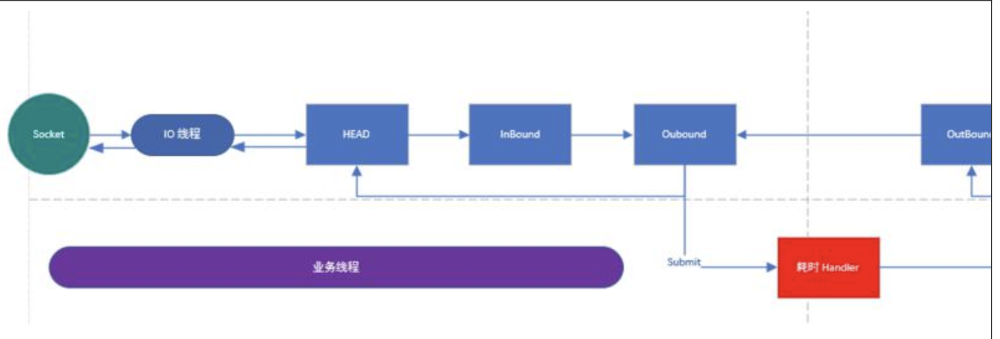

      说明：

      （1）解释一下上图，当 `IO` 线程轮询到一个 `socket` 事件，然后，`IO` 线程开始处理，当走到耗时 `handler` 的时候，将耗时任务交给业务线程池。

      （2）当耗时任务执行完毕再执行 `pipeline write` 方法的时候，(代码中使用的是 `context` 的 `write` 方法，上图画的是执行 `pipeline` 方法，是一个意思)会将任务这个任务交给 `IO` 线程。

   3. `write` 方法的源码(在 `AbstractChannelHandlerContext` 类)

      ```java
      private void write(Object msg, boolean flush, ChannelPromise promise) {
          AbstractChannelHandlerContext next = findContextOutbound();
          final Object m = pipeline.touch(msg, next);
          EventExecutor executor = next.executor();
          if(executor.inEventLoop()) {
              if(flush) {
                  next.invokeWriteAndFlush(m, promise);
              } else {
                  next.invokeWrite(m, promise);
              }
          } else {
              AbstractWriteTask task;
              if(flush) {
                  task = WriteAndFlushTask.newInstance(next, m, promise);
              } else {
                  task = WriteTask.newInstance(next, m, promise);
              }
              safeExecute(executor, task, promise, m);
          }
      }
      ```

      说明:

      （1）当判定下个 `outbound` 的 `executor` 线程不是当前线程的时候，会将当前的工作封装成 `task`，然后放入 `mpsc` 队列中，等待 `IO` 任务执行完毕后执行队列中的任务。

      （2）这里可以 Debug 来验证(提醒：Debug 时，服务器端 Debug, 客户端 `Run` 的方式)，当我们使用了 `group.submit(new Callable<Object> (){}` 在 `handler` 中加入线程池，就会进入到 `safeExecute(executor, task, promise, m);` 如果去掉这段代码，而使用普通方式来执行耗时的业务，那么就不会进入到 `safeExecute(executor, task, promise, m);`（说明：普通方式执行耗时代码，看我准备好的案例即可）

2. 处理耗时业务的第二种方式 -`Context` 中添加线程池

   1. 在添加 `pipeline` 中的 `handler` 时候，添加一个线程池

      ```java
      static final EventExecutorGroup group = new DefaultEventExecutorGroup(16);
      ServerBootstrap b = new ServerBootstrap();
                      b.group(bossGroup, workerGroup)
                       .channel(NioServerSocketChannel.class)
                       .option(ChannelOption.SO_BACKLOG, 100)
                       .handler(newLoggingHandler(LogLevel.INFO))
                       .childHandler(new ChannelInitializer<SocketChannel>() {
                           @Override
                           public void initChannel(SocketChannel ch) throws Exception {
                               ChannelPipeline p = ch.pipeline();
                               if(sslCtx != null) {
                                   p.addLast(sslCtx.newHandler(ch.alloc()));
                               }
                               //p.addLast(new LoggingHandler(LogLevel.INFO));
                               //p.addLast(new EchoServerHandler());
                               p.addLast(group, new EchoServerHandler());
                          }
                      });
      ```

      说明：

      （1）`handler` 中的代码就使用普通的方式来处理耗时业务。

      （2）当我们在调用 `addLast` 方法添加线程池后，`handler` 将优先使用这个线程池，如果不添加，将使用 `IO` 线程。

      （3）当走到 `AbstractChannelHandlerContext` 的 `invokeChannelRead` 方法的时候，`executor.inEventLoop()` 是不会通过的，因为当前线程是 `IO` 线程 `Context`（也就是 `Handler`）的 `executor` 是业务线程，所以会异步执行，debug 下源码。

      ```java
      static void invokeChannelRead(final AbstractChannelHandlerContext next, Object msg) {
          final Object m = next.pipeline.touch(ObjectUtil.checkNotNull(msg, "msg"), next);
          EventExecutor executor = next.executor();
          if(executor.inEventLoop()) {
              next.invokeChannelRead(m);
          } else {
              executor.execute(new Runnable() {//执行run
                  @Override
                  public void run() {
                      next.invokeChannelRead(m);
                  }
              });
          }
      }
      ```

      （4）验证时，我们如果去掉 `p.addLast(group,newEchoServerHandler());` 改成 `p.addLastnewEchoServerHandler());` 你会发现代码不会进行异步执行。

      （5）后面的整个流程就变成和第一个方式一样了

##### Handler 中加入线程池和 Context 中添加线程池梳理

（1）第一种方式在 `handler` 中添加异步，可能更加的自由，比如如果需要访问数据库，那我就异步，如果不需要，就不异步，异步会拖长接口响应时间。因为需要将任务放进 `mpscTask` 中。如果 `IO` 时间很短，`task` 很多，可能一个循环下来，都没时间执行整个 `task`，导致响应时间达不到指标。

（2）第二种方式是 `Netty` 标准方式(即加入到队列)，但是，这么做会将整个 `handler` 都交给业务线程池。不论耗时不耗时，都加入到队列里，不够灵活。

（3）各有优劣，从灵活性考虑，第一种较好。
