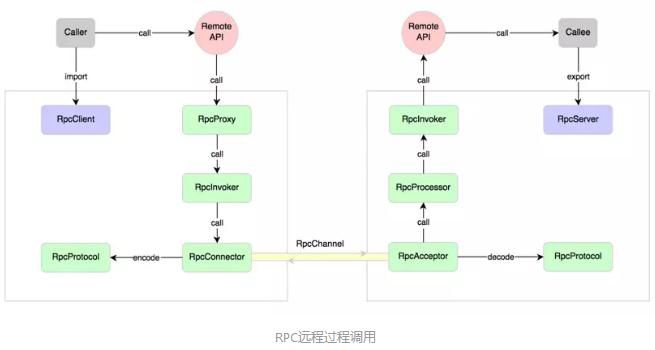
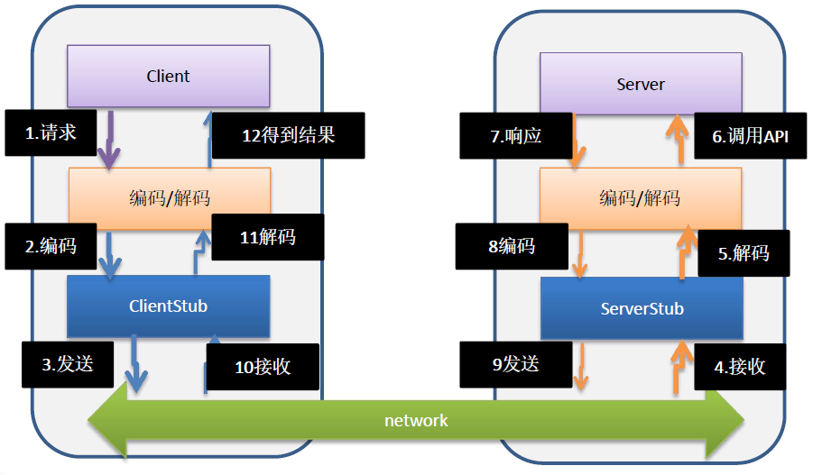

### 用 Netty 实现 dubbo RPC

#### 基本介绍

RPC（Remote Procedure Call）— 远程过程调用，是一个计算机通信协议。该协议允许运行于一台计算机的程序调用另一台计算机的子程序，而程序员无需额外地为这个交互作用编程。

两个或多个应用程序都分布在不同的服务器上，它们之间的调用都像是本地方法调用一样(如图)：

常见的 RPC 框架有: 比较知名的如阿里的 Dubbo 、 Google 的 gRPC 、 Go 语言的 rpcx 、 Facebook 的 Thrift 以及 Spring 旗下的 Spring Cloud。

简化版本的示意图如下：

* 术语说明：在 RPC 中，Client 叫服务消费者，Server 叫服务提供者。

* PRC 调用流程说明：

  * **服务消费方(client)以本地调用方式调用服务。**

  * client stub 接收到调用后负责将方法、参数等封装成能够进行网络传输的消息体。

  * client stub 将消息进行编码并发送到服务端。

  * server stub 收到消息后进行解码。

  * server stub 根据解码结果调用本地的服务。

  * 本地服务执行并将结果返回给 server stub。

  * server stub 将返回导入结果进行编码并发送至消费方。

  * client stub 接收到消息并进行解码

  * **服务消费方(client)得到结果。**

* RPC 的目标就是将 2-8 这些步骤都封装起来，用户无需关心这些细节，可以像调用本地方法一样即可完成远程服务调用。

#### 基于 Netty 实现 RPC

需求说明：

* dubbo 底层使用了 Netty 作为网络通讯框架，要求用 Netty 实现一个简单的 RPC 框架。

* 模仿 dubbo，消费者和提供者约定接口和协议，消费者远程调用提供者的服务，提供者返回一个字符串，消费者打印提供者返回的数据。

设计说明：

* 创建一个接口，定义抽象方法。用于消费者和提供者之间的约定。

* 创建一个提供者，该类需要监听消费者的请求，并按照约定返回数据。

* 创建一个消费者，该类需要透明的调用自己不存在的方法，内部需要使用 Netty 请求提供者返回数据。