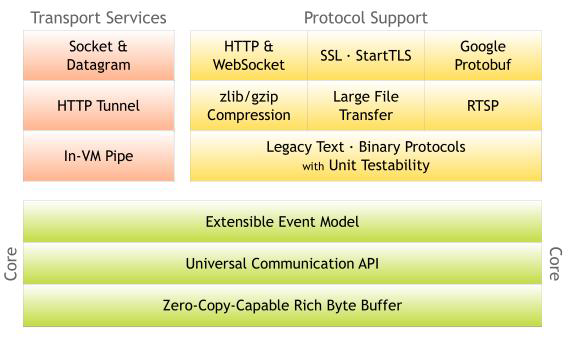
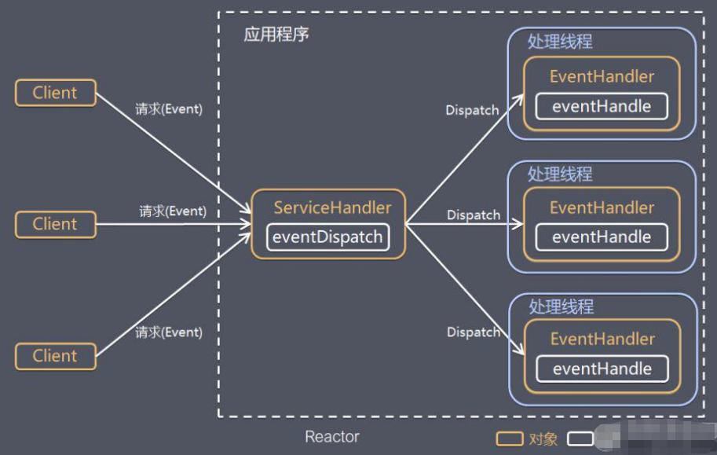
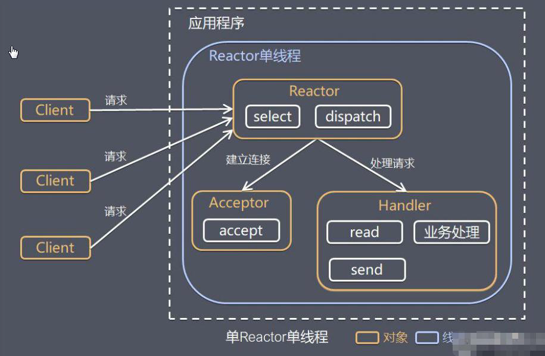
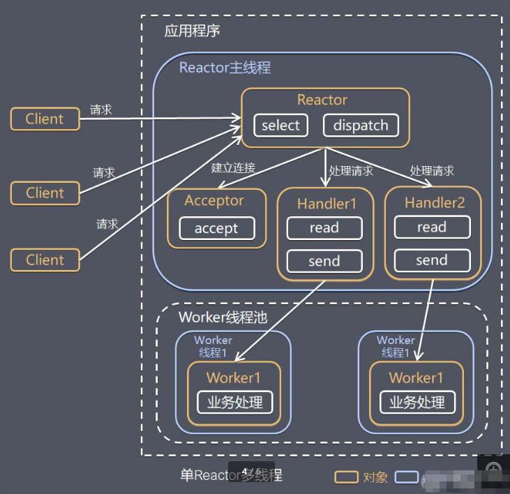
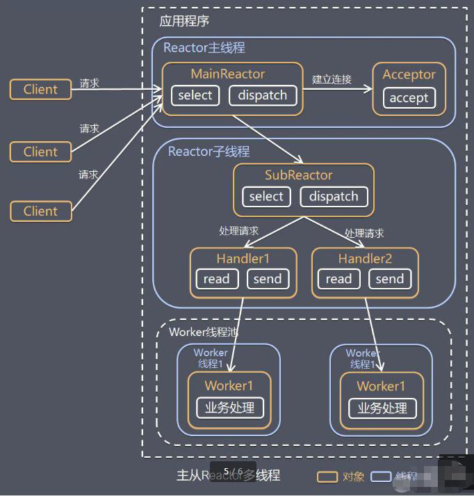
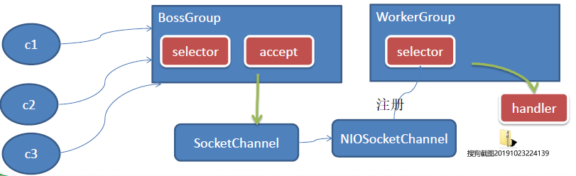
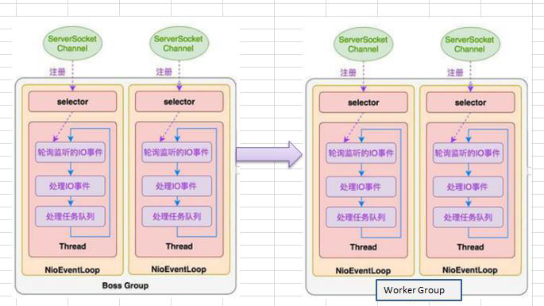
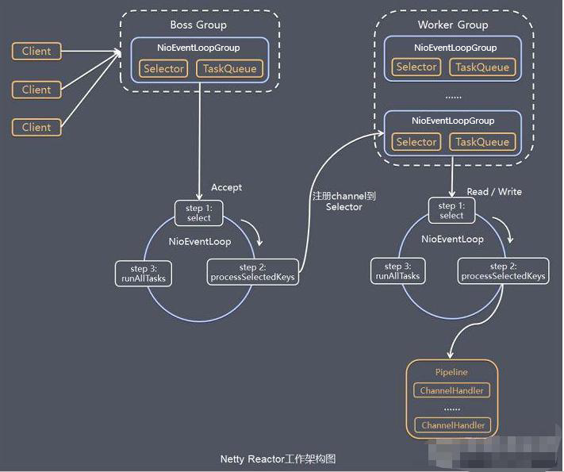

## Netty概述

### 原生NIO存在的问题

Netty就是基于Java NIO封装的，想要知道为什么会有Netty框架的存在，那就需要知道原生NIO存在的问题：

1. NIO 的类库和 API 繁杂，使用麻烦：需要熟练掌握 Selector、ServerSocketChannel、SocketChannel、ByteBuffer 等。
2. 需要具备其他的额外技能：要熟悉 Java 多线程编程，因为 NIO 编程涉及到 Reactor 模式，你必须对多线程和网络编程非常熟悉，才能编写出高质量的 NIO 程序。
3. 开发工作量和难度都非常大：例如客户端面临断连重连、网络闪断、半包读写、失败缓存、网络拥塞和异常流的处理等等。
4. JDK NIO 的 Bug：例如臭名昭著的 Epoll Bug，它会导致 Selector 空轮询，最终导致 CPU 100%。直到 JDK 1.7 版本该问题仍旧存在，没有被根本解决。

### Netty的诞生

基于以上问题，Netty就诞生了：

1. Netty 是由 JBOSS 提供的一个 Java 开源框架。Netty 提供异步的、基于事件驱动的网络应用程序框架，用以快速开发高性能、高可靠性的网络 IO 程序。
2. Netty 可以帮助你快速、简单的开发出一个网络应用，相当于简化和流程化了 NIO 的开发过程。
3. Netty 是目前最流行的 NIO 框架，Netty 在互联网领域、大数据分布式计算领域、游戏行业、通信行业等获得了广泛的应用，知名的 Elasticsearch 、Dubbo 框架内部都采用了 Netty。

### Netty的优点

- 设计优雅：适用于各种传输类型的统一 API 阻塞和非阻塞 Socket；基于灵活且可扩展的事件模型，可以清晰地分离关注点；高度可定制的线程模型 - 单线程，一个或多个线程池。
- 使用方便：详细记录的 Javadoc，用户指南和示例；没有其他依赖项，JDK 5（Netty 3.x）或 6（Netty 4.x）就足够了。
- 高性能、吞吐量更高：延迟更低；减少资源消耗；最小化不必要的内存复制。
- 安全：完整的 SSL/TLS 和 StartTLS 支持。
- 社区活跃、不断更新：社区活跃，版本迭代周期短，发现的 Bug 可以被及时修复，同时，更多的新功能会被加入。

### 线程模型介绍

目前存在的主要线程模式有：**传统阻塞 I/O 模型**、**Reactor 反应器模型**；

其中 Reactor 反应式模型根据 Reactor 数量和处理资源池线程数量不同分为三类实现：

- 单 Reactor 单线程；
- 单 Reactor 多线程；
- 主从 Reactir 多线程。

在 Netty 中主要以主从 Reactor 多线程模型为基础进行改进而形成的。

#### 传统阻塞 I/O 模型：

**模型特点**：

- 采用阻塞IO模式获取输入的数据；
- 每个连接都需要独立的线程完成数据的输入，业务处理，数据返回。

**所出现的问题**：

- 当并发数很大，就会创建大量的线程，占用很大系统资源。
- 连接创建后，如果当前线程暂时没有数据可读，该线程会阻塞在read 操作，造成线程资源浪费。

#### Reactor反应器模型

**简介**：

Reactor反应器模型的基本设计思想就是 I/O 复用+线程池，如图：

说明：

- Reactor 模式，通过一个或多个输入同时传递给服务处理器的模式（基于事件驱动）；
- 服务器端程序处理传入的多个请求，并将它们同步分派到相应的处理线程， 因此 Reactor 反应器模型也叫 Dispatcher 分发者模型；
- Reactor 模式使用IO复用监听事件，收到事件后，分发给某个线程（进程），这点就是网络服务器高并发处理关键；

**核心组成**：

1. Reactor：Reactor 在一个单独的线程中运行，负责监听和分发事件，分发给适当的处理程序来对 I/O 事件做出反应。 它就像公司的电话接线员，它接听来自客户的电话并将线路转移到适当的联系人；
2. Handlers：处理程序执行 I/O 事件要完成的实际事件，类似于客户想要与之交谈的公司中的实际业务员。Reactor 通过调度适当的处理程序来响应 I/O 事件，处理程序执行非阻塞操作。

**模型分类**：

1. 单 Reactor 单线程；
2. 单 Reactor 多线程；
3. 主从 Reactir 多线程。

##### 单Reactor单线程模型

工作原理图如下：

这种模型以前实现过，即 **`netty2-nio.nio-7-chat-room`** 模块中的 **chat_v2** 多人聊天室，接下来针对上图给出相对应的说明：

1. select 是前面 I/O 复用模型介绍的标准网络编程 API，可以实现应用程序通过一个阻塞对象监听多路连接请求；
2. Reactor 对象通过 Select 监控客户端请求事件，收到事件后通过 Dispatch 进行分发；
3. 如果是建立连接请求事件，则由 Acceptor 通过 Accept 处理连接请求，然后创建一个 Handler 对象处理连接完成后的后续业务处理；
4. 如果不是建立连接事件，则 Reactor 会分发调用连接对应的 Handler 来响应；
5. Handler 会完成 Read ==> 业务处理 ==> Send 的完整业务流程。

**模型优缺点分析**：

- 优点：模型简单，没有多线程、进程通信、竞争的问题，全部都在一个线程中完成；
- 缺点：性能问题，只有一个线程，无法完全发挥多核 CPU 的性能。Handler 在处理某个连接上的业务时，整个进程无法处理其他连接事件，很容易导致性能瓶颈；
- 缺点：可靠性问题，线程意外终止，或者进入死循环，会导致整个系统通信模块不可用，不能接收和处理外部消息，造成节点故障；
- 使用场景：客户端的数量有限，业务处理非常快速，比如 Redis在业务处理的时间复杂度 O(1) 的情况。

##### 单Reactor多线程模型

工作原理图如下：

接下来针对上图给出相对应的说明：

1. Reactor 对象通过 select 监控客户端请求事件, 收到事件后，通过 dispatch 进行分发；
2. 如果建立连接请求, 则右 Acceptor 通过 accept 处理连接请求, 然后创建一个 Handler 对象处理完成连接后的各种事件；
3. 如果不是连接请求，则由 reactor 分发调用连接对应的 handler 来处理；
4. handler 只负责响应事件，不做具体的业务处理，通过 read 读取数据后，会分发给后面的 worker 线程池的某个线程处理业务；
5. worker 线程池会分配独立线程完成真正的业务，并将结果返回给 handler ；
6. handler 收到响应后，通过 send 将结果返回给 client 。

**模型优缺点分析**：

- 优点：可以充分的利用多核 cpu 的处理能力；
- 缺点：多线程数据共享和访问比较复杂，reactor 处理所有的事件的监听和响应，在单线程运行， 在高并发场景容易出现性能瓶颈。

##### 主从Reactor多线程

工作原理图如下：

接下来针对上图给出相对应的说明：

1. Reactor 主线程 MainReactor 对象通过 select 监听连接事件，收到事件后，通过 Acceptor 处理连接事件；
2. 当 Acceptor 处理连接事件后，MainReactor 将连接分配给 SubReactor；
3. SubReactor 将连接加入到连接队列进行监听，并创建 handler 进行各种事件处理；
4. 当有新事件发生时，SubReactor 就会调用对应的 handler 处理；
5. handler 通过 read 读取数据，分发给后面的 worker 线程处理；
6. worker 线程池分配独立的 worker 线程进行业务处理，并返回结果。

**模型优缺点分析**：

- 优点：父线程与子线程的数据交互简单职责明确，父线程只需要接收新连接，子线程完成后续的业务处理；
- 优点：父线程与子线程的数据交互简单，Reactor 主线程只需要把新连接传给子线程，子线程无需返回数据；
- 缺点：编程复杂度较高；
- 结合实例：这种模型在许多项目中广泛使用，包括 Nginx 主从 Reactor 多进程模型，Memcached 主从多线程，Netty 主从多线程模型的支持。

##### Reactor模式小结

结合生活案例进行理解：

1. 单 Reactor 单线程，前台接待员和服务员是同一个人，全程为顾客服；
2. 单 Reactor 多线程，1 个前台接待员，多个服务员，接待员只负责接待；
3. 主从 Reactor 多线程，多个前台接待员，多个服务生。

Reactor 反应式模型具有以下有点：

1) 响应快，不必为单个同步时间所阻塞，虽然 Reactor 本身依然是同步的；
2) 可以最大程度的避免复杂的多线程及同步问题，并且避免了多线程/进程的切换开销；
3) 扩展性好，可以方便的通过增加 Reactor 实例个数来充分利用 CPU 资源；
4) 复用性好，Reactor 模型本身与具体事件处理逻辑无关，具有很高的复用性。

### Netty模型

Netty 主要基于主从 Reactors 多线程模型（如图）做了一定的改进，其中主从 Reactor 多线程模型有多个 Reactor。接下来会使用从易到难的三个工作原理示意图进行说明。

**工作原理示意图（简易版）如下**：

接下来针对上图给出相对应的说明：

1. BossGroup 线程维护 Selector，只关注 Accecpt 事件；
2. 当接收到 Accept 事件，获取到对应的 SocketChannel，封装成 NIOScoketChannel 并注册到 Worker 线程（事件循环），并进行维护；
3. 当 Worker 线程监听到 selector 中通道发生自己感兴趣的事件后，就进行处理（由 handler 处理），注意 handler 已经加入到通道。

**工作原理示意图（进阶版）如下**：

这一张图主要是为了体现在 Netty 模型中，Boss Group 是可以有多个的，这个特点就区别于主从 Reactor 多线程模型，在该模型中仅有一个主 Reactor 而已。

**工作原理示意图（详细版）**：

接下来针对上图给出相对应的说明：

1. Netty 抽象出两组线程池：BossGroup 专门负责接收客户端的连接，WorkerGroup 专门负责网络的读写；
2. BossGroup 和 WorkerGroup 类型都是 NioEventLoopGroup；
3. NioEventLoopGroup 相当于一个事件循环组，这个组中含有多个事件循环，每一个事件循环的类型就是 NioEventLoop；
4. NioEventLoop 表示一个不断循环的执行处理任务的线程， 每个 NioEventLoop 都有一个 selector，用于监听绑定在其上的 socket 的网络通讯；
5. NioEventLoopGroup 可以有多个线程, 即可以含有多个NioEventLoop；
6. 每个Boss NioEventLoop 循环执行的步骤有3步：
   1. 轮询 accept 事件；
   2. 处理 accept 事件 , 与 client 建立连接，生成 NioScocketChannel，并将其注册到某个 Worker NIOEventLoop 上的 selector；
   3. 处理任务队列的任务，即 runAllTasks。
7. 每个 Worker NIOEventLoop 循环执行的步骤：
   1. 轮询 read、write 事件；
   2. 处理 I/O 事件， 即 read、write 事件，在对应 NioScocketChannel 处理；
   3. 处理任务队列的任务，即 runAllTasks。
8. 每个 Worker NioEvenLoop 处理业务时，会使用 Pipeline（管道），Pipeline 包含了 Channel ，即通过 Pipeline 可以获取到对应通道，管道中维护了很多处理器。
